<p align="center">
  <a href="https://coldai.org/clip">
    <picture>
      <source media="(prefers-color-scheme: dark)" srcset="brand/clip-lockup-white.svg">
      
    </picture>
  </a>
</p>

<h3 align="center">One wallet for every network, and the networks stay out of your way.</h3>

<p align="center">
  A non-custodial wallet for 14 network families on one recovery phrase. It works with every dapp as it is, and it
  decodes every request into plain words before you sign. It is also an open kit for launching your own wallet.
</p>

<p align="center">
  <a href="LICENSE"></a>
  <a href="https://github.com/ColdAI-org/clip-wallet/actions/workflows/ci.yml"></a>
  
  <a href="#networks"></a>
  
</p>

<p align="center">
  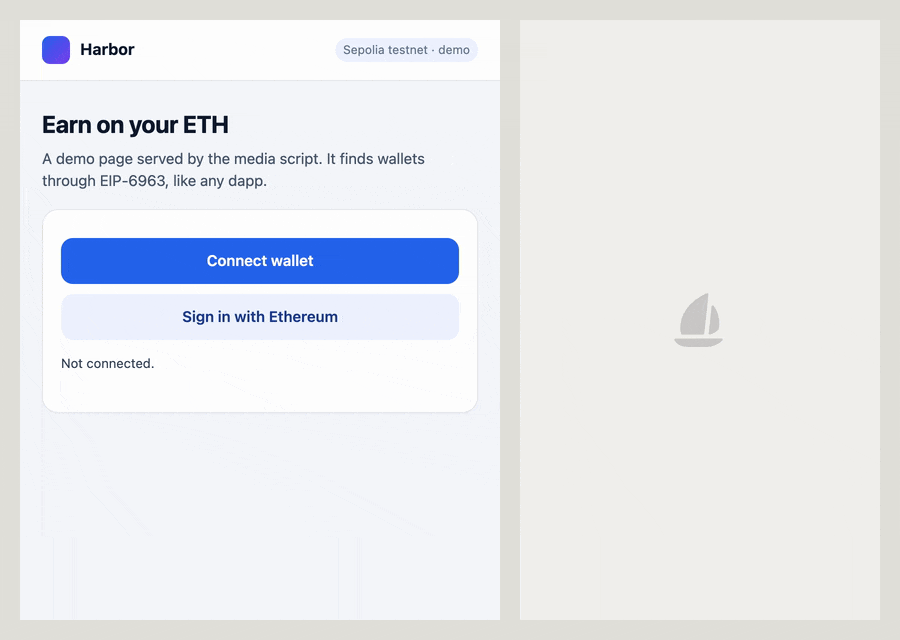
</p>

<p align="center">
  <a href="https://coldai.org/clip">Website</a> ·
  <a href="https://coldai.org/clip/docs">Developer docs</a> ·
  <a href="#quick-start">Quick start</a> ·
  <a href="#launch-your-own-wallet">Launch your own wallet</a> ·
  <a href="#clip-connect-for-dapps">Clip Connect SDK</a> ·
  <a href="#how-it-works">How it works</a> ·
  <a href="#security">Security</a>
</p>

> [!WARNING]
> **Testnet preview.** Clip Wallet runs on test networks by default, and test tokens have no value. It has not had an
> external security audit yet, and the store listings are not live. Don't use it with real funds.

## Why Clip

**Networks are invisible.** You see *USDC $412*, not five USDC rows on five chains. Balances from the same issuer merge
across networks. Bridged copies never merge: they stay separate and labelled. The wallet names a network only where a
mistake loses money. One example is an address that can receive on several networks:

<table>
  <tr>
    <td width="33%"><picture><source media="(prefers-color-scheme: dark)" srcset="docs/media/home-dark.webp">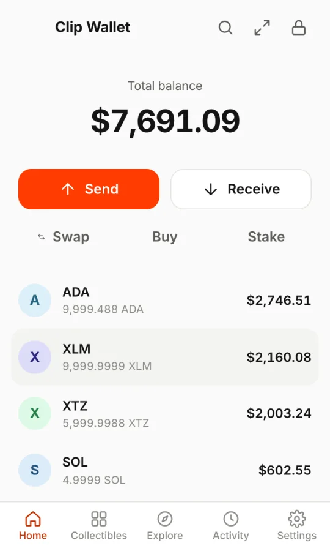</picture></td>
    <td width="33%"><picture><source media="(prefers-color-scheme: dark)" srcset="docs/media/send-network-dark.webp">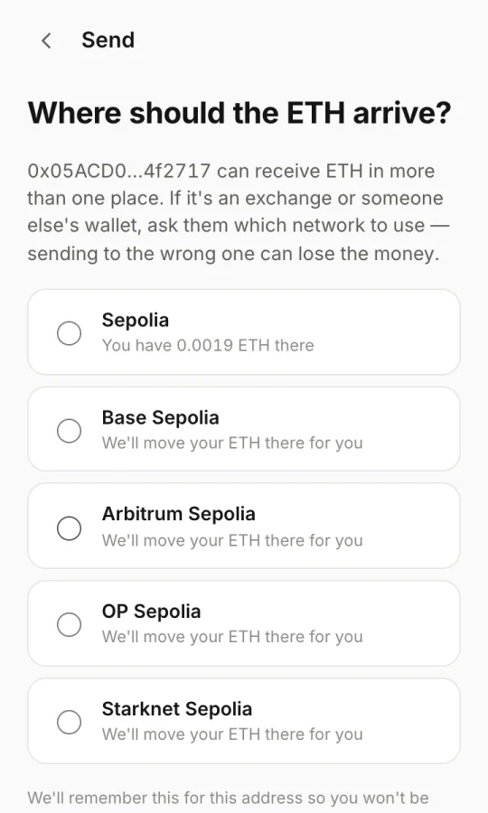</picture></td>
    <td width="33%"><picture><source media="(prefers-color-scheme: dark)" srcset="docs/media/approval-unlimited-dark.webp">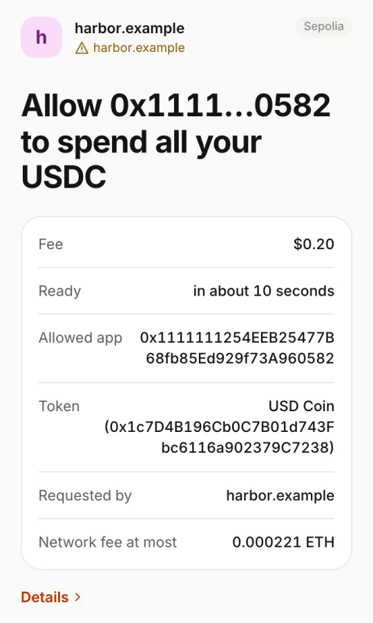</picture></td>
  </tr>
  <tr>
    <td align="center"><sub>Home: one balance, merged by asset</sub></td>
    <td align="center"><sub>The network question, only when it matters</sub></td>
    <td align="center"><sub>An unlimited token approval, called out</sub></td>
  </tr>
</table>

- **One seed, 14 families.** EVM (Ethereum, Base, Arbitrum, Optimism, Hedera EVM and any EVM chain by id), Hedera,
  Solana, Bitcoin, Sui, Aptos, Cardano, Polkadot SDK, Starknet, TON, NEAR, Stellar, Tezos and Algorand, all from one
  BIP-39 phrase.
- **Works with every dapp, with no changes to the dapp.** 1Mask speaks each ecosystem's own standard: EIP-1193 with
  EIP-6963, the Wallet Standard (Solana, Sui, Aptos, Bitcoin), CIP-30, `injectedWeb3`, TON Connect, NEAR Wallet
  Selector, SEP-43, Beacon, ARC-1, and WalletConnect v2. It is tested against stock wallet pickers and live testnet
  dapps.
- **Approval screens that decode what you sign.** Every request becomes a plain-words `DecodedRequest` that shows the
  title, balance changes, fee, time and warnings. Unlimited approvals, permits, look-alike tokens and unknown contract
  calls are called out. Requests the wallet can't read are **blocked by default**: no blind signing.
- **Clip Connect** (`@clip-wallet/connect`): a wallet-agnostic dapp SDK built on public standards only. One
  `connect()` call returns CAIP-10 accounts. `pay()` uses EIP-5792 and ERC-7682 to bring in funds from the user's other
  balances.
- **Settle on Hedera.** When an app asks for money you hold on another network, a bonded Connector pays it for you.
  CLPR proves both sides to an order book on Hedera. If the payment doesn't arrive, the Connector's bond pays you back.
- **Passkeys and hardware wallets.** Passkey unlock (WebAuthn PRF), an optional passkey backup the server can't open,
  Face ID and fingerprint unlock on mobile, Ledger and Keystone.
- **An open kit for your own wallet.** `npx create-clip-wallet` or the Scaffold-HBAR template gives you a branded
  wallet with its own name, icon, extension id and rdns, on testnet by default.
- **Everywhere you are:** a browser extension (Chrome, Edge, Firefox), a desktop app with a built-in dapp browser, and
  an iOS/Android app. All three share one engine.
- **12 languages:** English and 11 translations, right-to-left Arabic included, with translation QA in the test suite.

## See it

<table>
  <tr>
    <td width="50%" align="center">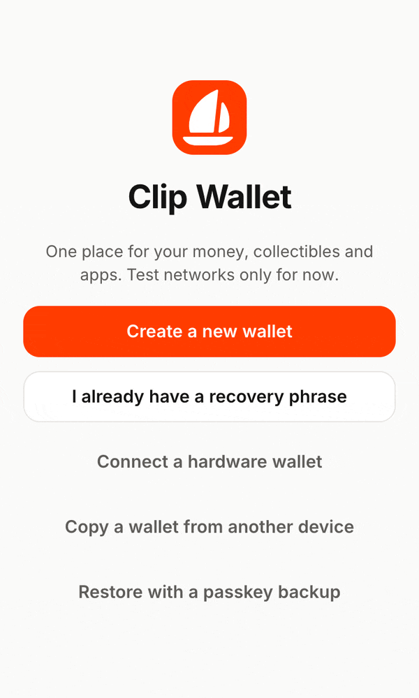<br><sub>Onboarding → Home (fresh testnet wallet; the phrase reveal is never recorded)</sub></td>
    <td width="50%" align="center">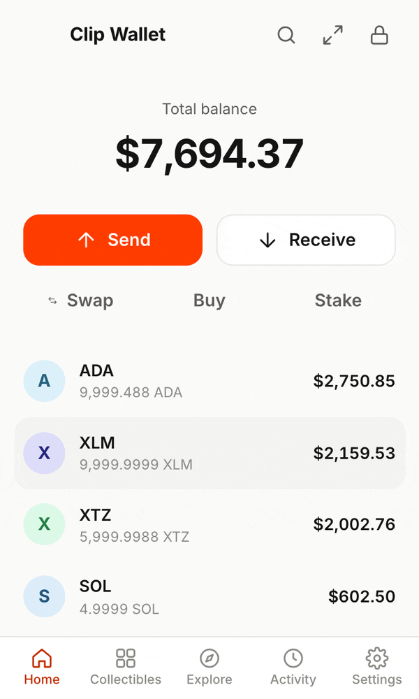<br><sub>Send: the network question, then exactly what you'll sign</sub></td>
  </tr>
</table>

<details>
<summary><b>More screens</b> (light and dark follow your system theme)</summary>
<br>

<table>
  <tr>
    <td width="25%"><picture><source media="(prefers-color-scheme: dark)" srcset="docs/media/onboarding-welcome-dark.webp">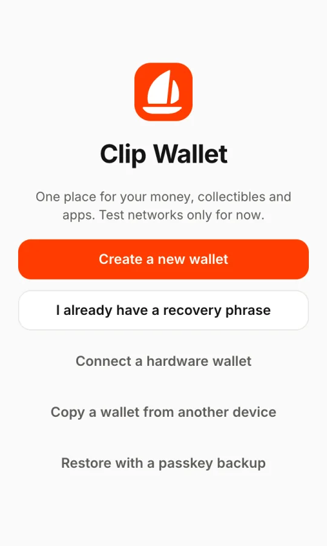</picture></td>
    <td width="25%"><picture><source media="(prefers-color-scheme: dark)" srcset="docs/media/onboarding-phrase-hidden-dark.webp">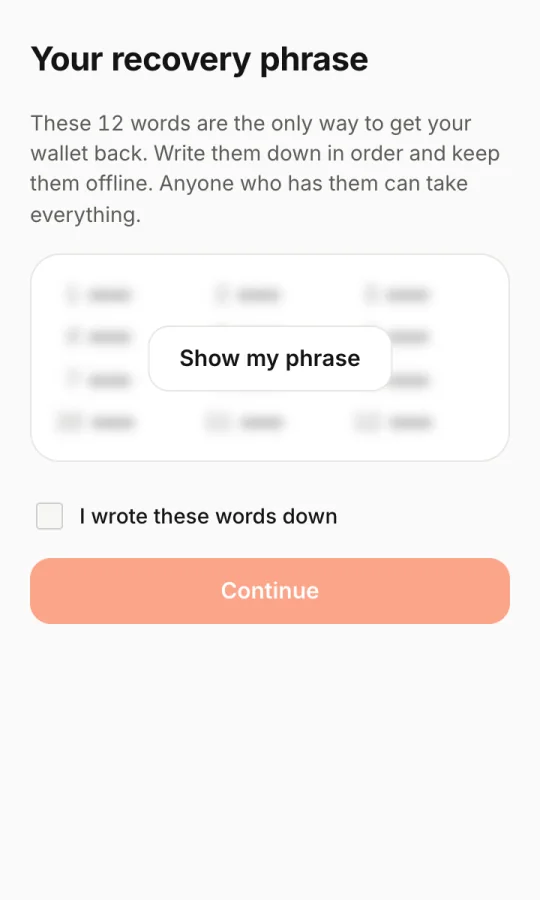</picture></td>
    <td width="25%"><picture><source media="(prefers-color-scheme: dark)" srcset="docs/media/send-dark.webp">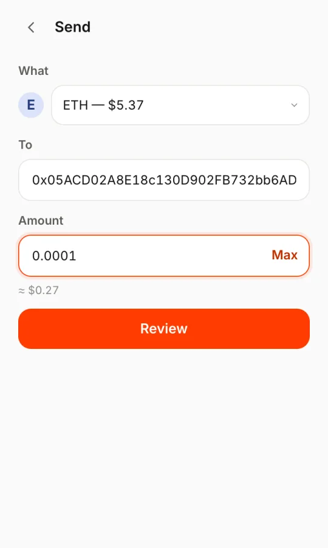</picture></td>
    <td width="25%"><picture><source media="(prefers-color-scheme: dark)" srcset="docs/media/approval-send-dark.webp">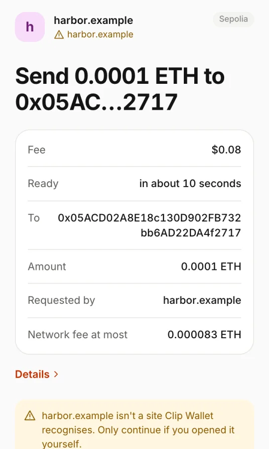</picture></td>
  </tr>
  <tr>
    <td align="center"><sub>Welcome</sub></td>
    <td align="center"><sub>Phrase hidden until you ask</sub></td>
    <td align="center"><sub>Send</sub></td>
    <td align="center"><sub>A dapp's send request</sub></td>
  </tr>
  <tr>
    <td><picture><source media="(prefers-color-scheme: dark)" srcset="docs/media/dapp-connect-dark.webp">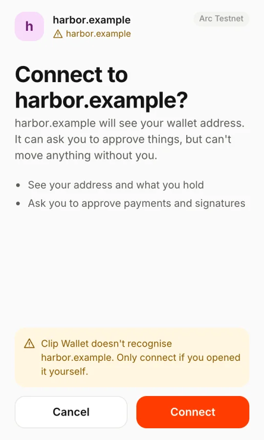</picture></td>
    <td><picture><source media="(prefers-color-scheme: dark)" srcset="docs/media/swap-dark.webp">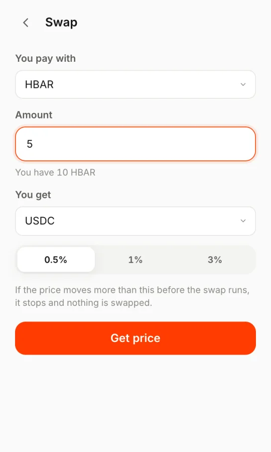</picture></td>
    <td><picture><source media="(prefers-color-scheme: dark)" srcset="docs/media/collectibles-dark.webp">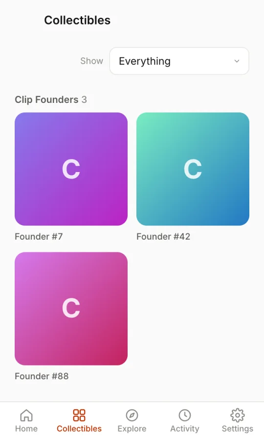</picture></td>
    <td><picture><source media="(prefers-color-scheme: dark)" srcset="docs/media/settings-dark.webp">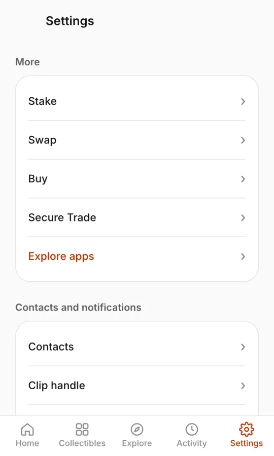</picture></td>
  </tr>
  <tr>
    <td align="center"><sub>A dapp asks to connect</sub></td>
    <td align="center"><sub>Swap</sub></td>
    <td align="center"><sub>Collectibles (fixture data)</sub></td>
    <td align="center"><sub>Settings</sub></td>
  </tr>
</table>

Screens come from the real extension build on public testnets with the dapp matrix's test wallet. The exception is
Collectibles, which uses the fixture build's mock NFTs because the test wallet holds none. They are regenerated by
`pnpm --filter @clip-wallet/extension media` and `node tools/media/build.mjs`.

</details>

**Desktop:** the same wallet, with a built-in browser. A dapp opened there finds the wallet through EIP-6963, and each
site gets its own session.

<p align="center">
  <picture>
    <source media="(prefers-color-scheme: dark)" srcset="docs/media/desktop-browser-dark.webp">
    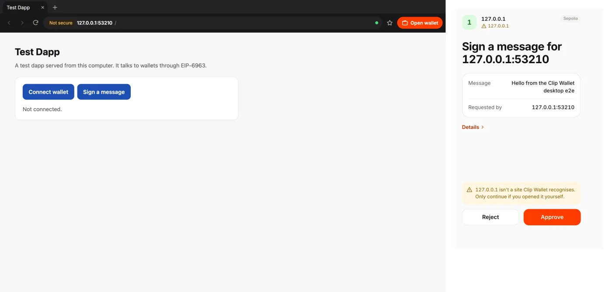
  </picture>
</p>

<a id="networks"></a>
## Networks and dapp standards

All 14 families are tested end to end on their public testnets with the real build, in two suites. The
[dapp matrix](docs/r1/dapp-matrix.md) drives each ecosystem's own dapp library (**connect**, **sign** and verify, **send**
and confirm on chain, **approval** decoded). The [picker matrix](docs/r1/picker-matrix.md) drives the wallet pickers
dapps actually ship, plus 8 hosted testnet dapps.

| Family | Testnet | How dapps reach Clip | Dapp matrix | Stock pickers |
| --- | --- | --- | --- | --- |
| EVM | Sepolia, Base / Arbitrum / OP Sepolia, … | EIP-1193 + EIP-6963, EIP-5792, WalletConnect | connect · sign · send · approval | RainbowKit, ConnectKit, Reown AppKit |
| Hedera | Hedera testnet | EIP-1193 on Hedera EVM (296), Hedera extension discovery / HashConnect over WalletConnect | connect · sign · send · approval (EVM path) | DAppConnector / HashConnect: not run yet (needs a WalletConnect project id) |
| Solana | Devnet | Wallet Standard | connect · sign · send · approval | wallet-adapter UI |
| Bitcoin | Testnet4 | Bitcoin Wallet Standard features, PSBT | connect · sign (BIP-322) · send · approval ¹ | sats-connect: needs a listing |
| Sui | Testnet | Wallet Standard | connect · sign · send · approval | dapp-kit |
| Aptos | Testnet | Wallet Standard (AIP-62) | connect · sign ¹ | wallet-adapter (ant-design) |
| Cardano | Preprod | CIP-30, CIP-8 | connect · sign · send · approval | Mesh |
| Polkadot SDK | Westend | `injectedWeb3` | connect · sign · send · approval | DOT Connect; Talisman Connect with an entry |
| Starknet | Sepolia | get-starknet (`window.starknet_clipwallet`) | connect · sign · send · approval | starknetkit with a connector |
| TON | Testnet | TON Connect (JS bridge) | connect · sign · approval ¹ | TON Connect UI with Clip's entry |
| NEAR | Testnet | NEAR Wallet Selector module, NEP-413 | connect · sign ¹ | Wallet Selector + `@clip-wallet/kit-modules/near` |
| Stellar | Testnet | Stellar Wallets Kit module (SEP-43), SEP-53 | connect · sign · send · approval | Stellar Wallets Kit + module |
| Tezos | Shadownet | Beacon (TZIP-10) | connect · sign · send · approval | Beacon lists Clip; connecting from its modal is a known gap |
| Algorand | TestNet | use-wallet adapter (ARC-1, ARC-6) | connect · send · approval | use-wallet UI + `@clip-wallet/kit-modules/algorand` |

<sub>¹ The remaining steps wait for testnet funds in the matrix wallet. Each approval says plainly why it can't go
ahead, for example "You don't have enough APT to pay the network fee". Bitcoin passed send and approval in an earlier
funded run.</sub>

<table>
  <tr>
    <td width="52%">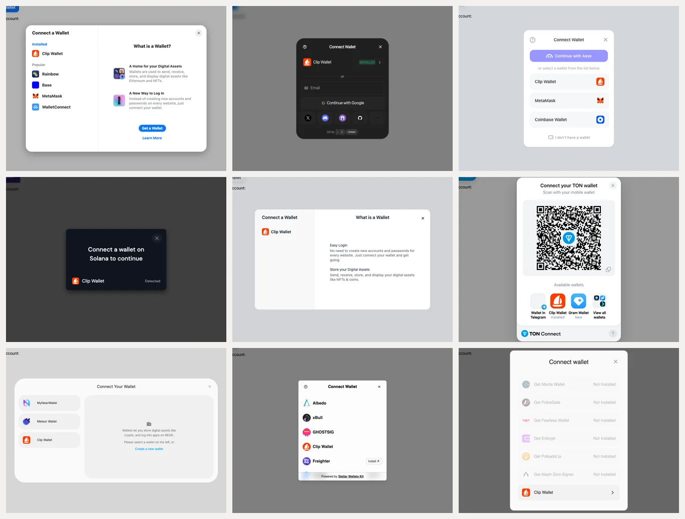</td>
    <td width="48%">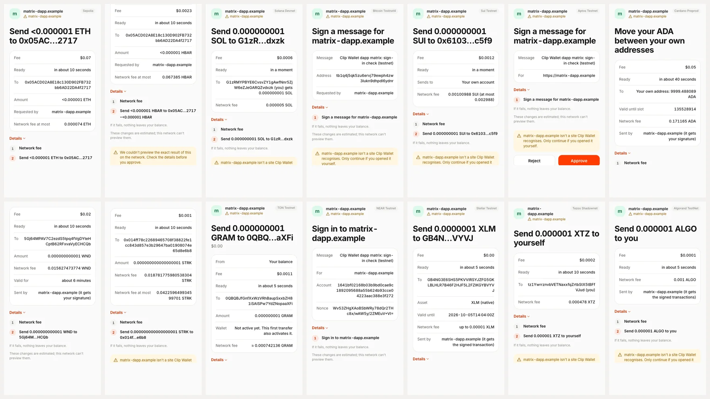</td>
  </tr>
  <tr>
    <td align="center"><sub>Clip in stock wallet pickers</sub></td>
    <td align="center"><sub>A decoded request from each family's dapp library (dapp matrix)</sub></td>
  </tr>
</table>

Mainnet is off. A mainnet build needs an explicit checklist in `clip.config.ts`, and `mainnetProblems()` must come back
empty. Listing drafts for the registries that need one are in [`docs/listings`](docs/listings).

## Quick start

### Use it (testnet)

Store listings are pending. Until they're live, build the extension and load it unpacked:

```sh
git clone https://github.com/ColdAI-org/clip-wallet && cd clip-wallet
corepack enable && pnpm install          # Node 24, pnpm 12
pnpm --filter @clip-wallet/extension build
# Chrome or Edge → chrome://extensions → Developer mode → Load unpacked → apps/extension/.output/chrome-mv3
```

Create a wallet and get test tokens from each network's faucet (Hedera: [portal.hedera.com](https://portal.hedera.com)).
Then open any testnet dapp and pick **Clip Wallet**.

### Develop

```sh
pnpm install
pnpm typecheck && pnpm test && pnpm harness        # what CI and AGENTS.md require
pnpm --filter @clip-wallet/extension dev            # Chrome with the extension loaded (WXT, hot reload)
pnpm --filter @clip-wallet/extension e2e            # Playwright on the real build and the fixture build
pnpm --filter @clip-wallet/desktop dev              # the desktop app (Electron)
cd apps/mobile && pnpm ios                          # or pnpm android (Expo dev build, see apps/mobile/README.md)
```

The developer docs are at [coldai.org/clip/docs](https://coldai.org/clip/docs): architecture, the signing flow,
per-ecosystem dapp guides, the kit, extending Clip Wallet, services, security and the API reference for every package.
Their sources are in [`apps/docs`](apps/docs) (VitePress; `pnpm --filter docs build`).

Coding agents start at [AGENTS.md](AGENTS.md) (rules that never break, recipes) and [llms.txt](llms.txt).

## Launch your own wallet

Clip Wallet is also a kit. Every `@clip-wallet/*` package, the extension as a library (`@clip-wallet/extension-kit`)
and the screens are yours to build on. A kit-built wallet announces **its own** name, icon and rdns, keeps the security
floor, and starts on testnet.

```sh
npx create-clip-wallet my-wallet --name "Acme Wallet" --rdns com.acme.wallet --accent "#0B7A3B" \
  --networks "evm:*,hedera,solana,bitcoin"
cd my-wallet && pnpm install && pnpm extension:build && pnpm next:dev
```

You get the same project from the [Scaffold-HBAR](https://github.com/hedera-dev/scaffold-hbar) template, which adds a
Next.js dapp that connects to your wallet on Hedera testnet:

```sh
npm create scaffold-hbar@latest -- --template ColdAI-org/scaffold-hbar-clip-wallet
cd <project> && pnpm install && pnpm wallet:identity --name "Acme Wallet" --rdns com.acme.wallet
```

Everything a wallet maker changes is in one file:

```ts
// clip.config.ts
export default defineConfig({
  name: "Acme Wallet",
  rdns: "com.acme.wallet",              // a reverse domain you own
  icon: "./icon.svg",
  theme: { accent: "#0B7A3B" },         // contrast is checked; small accent text is derived to 4.5:1
  networks: ["evm:*", "hedera", "solana"],
  mainnet: false,
});
```

`create-clip-wallet` also writes listing-submission drafts for your identity (EIP-6963, WalletConnect, TON Connect,
NEAR, Stellar, Tezos, Algorand). `pnpm wallet:mainnet-check` tells you what is left before mainnet. See
[`packages/create-clip-wallet`](packages/create-clip-wallet).

## Clip Connect for dapps

`@clip-wallet/connect` finds Clip Wallet first, then falls back to any other EIP-6963 or Wallet Standard wallet, then
`window.ethereum`, then WalletConnect. It has no runtime dependencies (about 5 KB gzipped) and comes with adapters for
React, wagmi and the Solana wallet adapter.

```ts
import { connect } from "@clip-wallet/connect";

const wallet = await connect({ chains: [84532, 11155111] });   // Base Sepolia, Ethereum Sepolia
console.log(wallet.wallet.name, wallet.accounts);               // "Clip Wallet", ["eip155:84532:0x…"]

// Speak in assets: Clip picks the chain, and EIP-5792 + ERC-7682 bring in the shortfall from other balances.
const paid = await wallet.pay({ asset: "usdc", amount: "25", to: "0xShop…" });
const { status } = await paid.wait();                           // "confirmed" | "failed"
```

Nothing to install for existing dapps: wagmi, RainbowKit, AppKit and every other EIP-6963 or Wallet Standard dapp
already lists Clip. More in [`packages/connect`](packages/connect).

## How it works

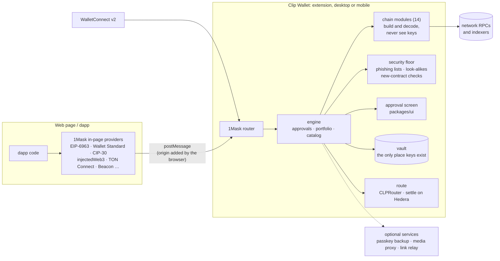
```mermaid
flowchart LR
  subgraph Dapp["Web page / dapp"]
    D["dapp code"] --> P["1Mask in-page providers<br/>EIP-6963 · Wallet Standard · CIP-30<br/>injectedWeb3 · TON Connect · Beacon …"]
  end
  WC["WalletConnect v2"] --> R
  P -- "postMessage<br/>(origin added by the browser)" --> R
  subgraph Wallet["Clip Wallet: extension, desktop or mobile"]
    R["1Mask router"] --> E["engine<br/>approvals · portfolio · catalog"]
    E --> C["chain modules (14)<br/>build and decode,<br/>never see keys"]
    E --> S["security floor<br/>phishing lists · look-alikes<br/>new-contract checks"]
    E --> UI["approval screen<br/>packages/ui"]
    E --> V[("vault<br/>the only place keys exist")]
    E --> RT["route<br/>CLPRouter · settle on Hedera"]
  end
  C --> N[("network RPCs<br/>and indexers")]
  E -.-> SV["optional services<br/>passkey backup · media proxy · link relay"]
```

Every request takes the same path, whichever standard it arrives through:

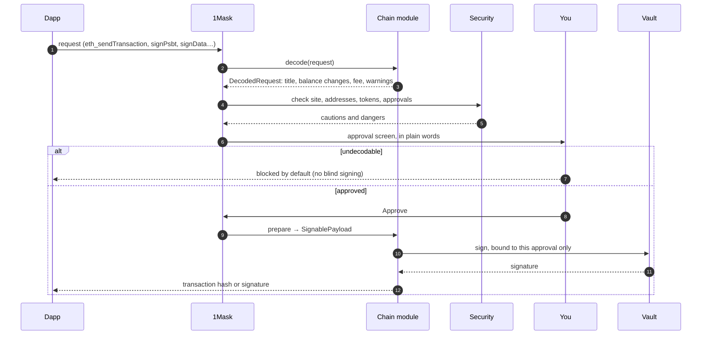
```mermaid
sequenceDiagram
  autonumber
  participant App as Dapp
  participant M as 1Mask
  participant C as Chain module
  participant S as Security
  participant U as You
  participant V as Vault
  App->>M: request (eth_sendTransaction, signPsbt, signData…)
  M->>C: decode(request)
  C-->>M: DecodedRequest: title, balance changes, fee, warnings
  M->>S: check site, addresses, tokens, approvals
  S-->>M: cautions and dangers
  M->>U: approval screen, in plain words
  alt undecodable
    U-->>App: blocked by default (no blind signing)
  else approved
    U->>M: Approve
    M->>C: prepare → SignablePayload
    C->>V: sign, bound to this approval only
    V-->>C: signature
    C-->>App: transaction hash or signature
  end
```

When an app asks you to pay on one network and the money is on another, settle on Hedera fills the gap in the same
approval:

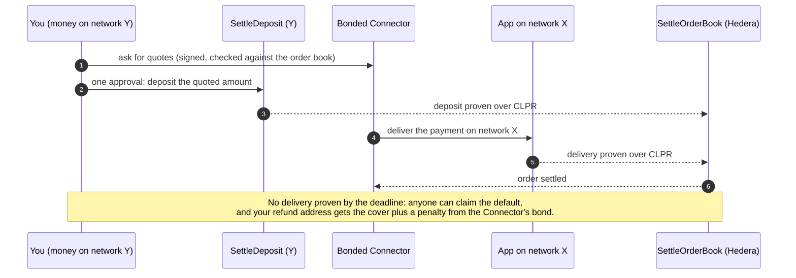
```mermaid
sequenceDiagram
  autonumber
  participant U as You (money on network Y)
  participant D as SettleDeposit (Y)
  participant K as Bonded Connector
  participant X as App on network X
  participant H as SettleOrderBook (Hedera)
  U->>K: ask for quotes (signed, checked against the order book)
  U->>D: one approval: deposit the quoted amount
  D-->>H: deposit proven over CLPR
  K->>X: deliver the payment on network X
  X-->>H: delivery proven over CLPR
  H-->>K: order settled
  Note over U,H: No delivery proven by the deadline: anyone can claim the default,<br/>and your refund address gets the cover plus a penalty from the Connector's bond.
```

<details>
<summary><b>Settle on Hedera in the wallet</b> (fixture build)</summary>
<br>
<p>
  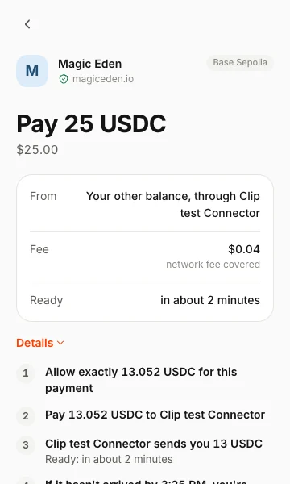
  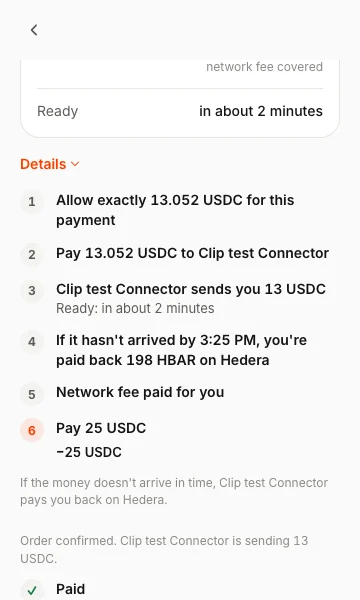
  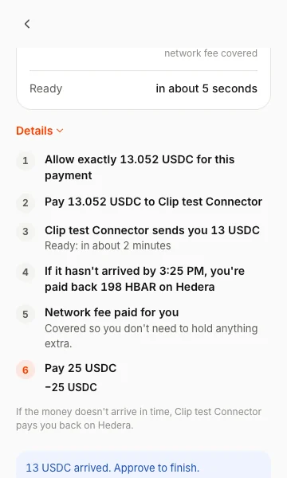
</p>

The testnet order book and deposit contracts are live. The test Connector's reference service runs locally, so these
screens come from the fixture build. Details: [`packages/route`](packages/route) and
[CLPR](https://coldai.org/clpr).
</details>

| Path | What |
| --- | --- |
| [`packages/core`](packages/core) | The contract: `ChainModule`, `DecodedRequest`, assets, errors |
| [`packages/vault`](packages/vault) | Phrase, derivation for 14 families, encryption, approval-bound signing, passkeys. The only package that touches keys |
| [`packages/chains-*`](packages) | One `ChainModule` per family |
| [`packages/1mask`](packages/1mask) | Dapp connectors for every family, the router, WalletConnect |
| [`packages/engine`](packages/engine) | Orchestration shared by the extension, desktop and mobile |
| [`packages/extension-kit`](packages/extension-kit), [`packages/ui`](packages/ui) | The extension as a library; React screens and theme tokens |
| [`packages/connect`](packages/connect), [`packages/kit-modules`](packages/kit-modules) | Clip Connect SDK; modules for NEAR, Stellar, Algorand and Tezos pickers |
| [`packages/route`](packages/route) | Route and fund on CLPRouter; settle on Hedera |
| [`packages/security`](packages/security), [`features`](packages/features), [`social`](packages/social), [`plugins`](packages/plugins), [`hardware`](packages/hardware), [`names`](packages/names), [`link`](packages/link) | Security floor; swaps, staking, on-ramps; contacts and handles; sandboxed plugins; Ledger and Keystone; name services; linked devices |
| [`apps/extension`](apps/extension), [`apps/desktop`](apps/desktop), [`apps/mobile`](apps/mobile) | Chrome/Edge/Firefox (MV3, WXT), Electron, Expo |
| [`services/*`](services) | Optional Cloudflare Workers: passkey backup, NFT media proxy, link relay |
| [`packages/create-clip-wallet`](packages/create-clip-wallet), [`templates/`](templates/scaffold-hbar-clip-wallet) | The kit: scaffolder and Scaffold-HBAR template |

<a id="security"></a>
## Security

- **One key holder.** Only `packages/vault` derives keys and signs. Chain modules build and decode, but never see keys.
  Screens never import the vault. `pnpm harness` fails any change that breaks these rules.
- **At rest:** Argon2id (64 MiB, t=3), then XChaCha20-Poly1305. Passkey unlock wraps the vault key with HKDF over the
  WebAuthn PRF output, and the password always keeps working.
- **Approval-bound signing.** The vault signs only the payload of the request you approved, once, within 10 minutes.
- **No blind signing by default.** Advanced mode allows it per request, after a warning.
- **Origins come from the browser, never from the page.** WalletConnect peers that Verify can't confirm are shown as
  unverified.
- **A security floor nobody can switch off:** open phishing lists, decode-before-approve, look-alike address and
  new-contract checks. A mainnet config below the floor is refused.
- **Supply chain:** crypto libraries pinned to exact versions (the harness enforces it), every Action pinned by SHA,
  Dependabot, CodeQL, a reproducible extension build checked in CI, SLSA provenance and SHA256SUMS on releases, npm
  provenance, signed tags.
- **Optional services see ciphertext and hashes only.** The threat model is in
  [`services/backup`](services/backup/README.md).

**Audit status.** An internal review in October 2026 covered the vault, the approval path for all 14 families, 1Mask,
WalletConnect, plugins, hardware signing, the services and the supply chain. It found 47 issues (2 critical, 5 high,
18 medium, 22 low) and all of them are fixed, each with a regression test: there are no open findings
([report](docs/audit/internal-audit-2026-10.md)). The **external audit comes before any mainnet build**.

Report vulnerabilities privately: [SECURITY.md](SECURITY.md) (GitHub private reporting, or
[shayan@coldai.org](mailto:shayan@coldai.org)).

## Status

| Area | State |
| --- | --- |
| Extension (Chrome, Edge) | Feature-complete on testnets. Unit, harness and Playwright e2e (real and fixture builds) are green |
| Extension (Firefox) | Builds as MV3 and passes `addons-linter`. No Firefox e2e yet, and Clip Plugins are left out |
| Desktop (macOS, Windows, Linux) | Electron app with a built-in dapp browser. e2e on all three in CI. Unsigned unless signing secrets are set |
| Mobile (iOS, Android) | Screens and engine tested (vitest and jest-expo). No store builds yet |
| Networks | 26 families (85 of the 87 CLPR networks) on testnets. **Mainnet is off**, behind a build flag and a checklist |
| Settle on Hedera | Testnet contracts live. The test Connector runs locally |
| Store listings | Packages, copy, screenshots and permission justifications are ready. **Nothing has been submitted yet** |
| Security | Internal review done. **External audit pending** |
| Legal | Privacy policy and terms are **drafts awaiting legal review** ([`docs/legal`](docs/legal)) |

## Roadmap

- External security audit, then mainnet behind the checklist.
- Chrome Web Store, Edge Add-ons and Firefox AMO listings; signed desktop builds; App Store and Play builds.
- Listings in the registries that need one (WalletConnect Explorer, TON Connect, Cardano, Talisman, starknetkit,
  sats-connect), and connecting from Beacon's modal.
- Object-level previews for Sui and Aptos calls (what leaves your wallet, not only coin balances).
- Settle on Hedera with hosted Connectors, and more routes over CLPR.
- Firefox e2e; more languages.

## Contributing

Contributions are welcome. Read [CONTRIBUTING.md](CONTRIBUTING.md) first. Every commit needs a
[DCO](https://developercertificate.org/) sign-off (`git commit -s`), and `pnpm typecheck && pnpm test && pnpm harness`
must pass. Please also read the [Code of Conduct](CODE_OF_CONDUCT.md). Changes are listed in
[CHANGELOG.md](CHANGELOG.md). Never put a recovery phrase, private key or `.env` value in an issue, a PR or a test.

## License

[Apache License 2.0](LICENSE) © 2026 [ColdAI](https://coldai.org). See [NOTICE](NOTICE) for third-party notices.

"Clip Wallet", "1Mask" and the Clip Wallet logo are trademarks of ColdAI. The Apache License 2.0 grants no rights to
them (Section 6). Forks and kit-built wallets use their own name and icon; see [brand/README.md](brand/README.md).

<p align="center">
  <br>
  <a href="https://coldai.org">
    <picture>
      <source media="(prefers-color-scheme: dark)" srcset=".github/assets/coldai-logo-white.png">
      
    </picture>
  </a>
  <br>
  <sub>Built by <a href="https://coldai.org">ColdAI</a> on <a href="https://coldai.org/clpr">CLPR</a>, the bridgeless cross-ledger protocol from LF Decentralized Trust · <a href="https://coldai.org/clip">coldai.org/clip</a></sub>
</p>
