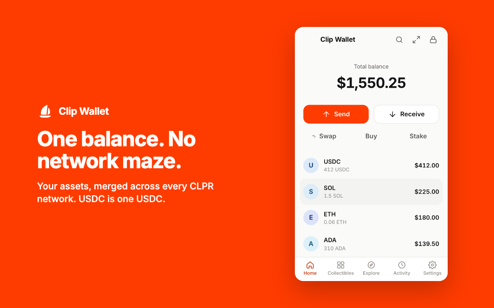
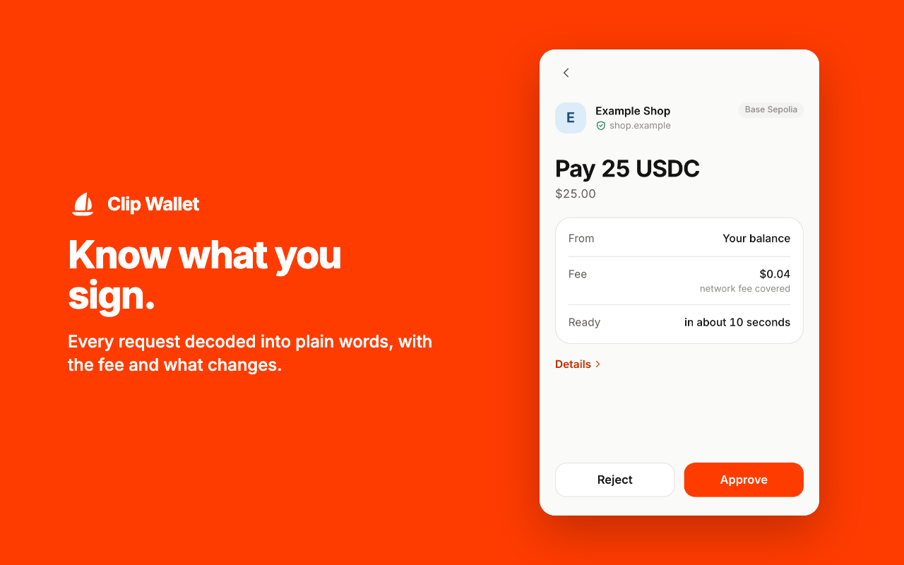
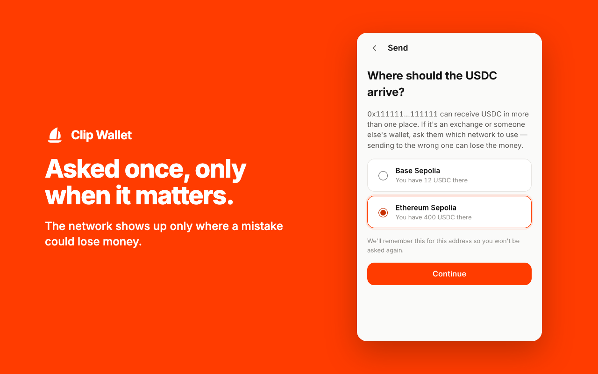
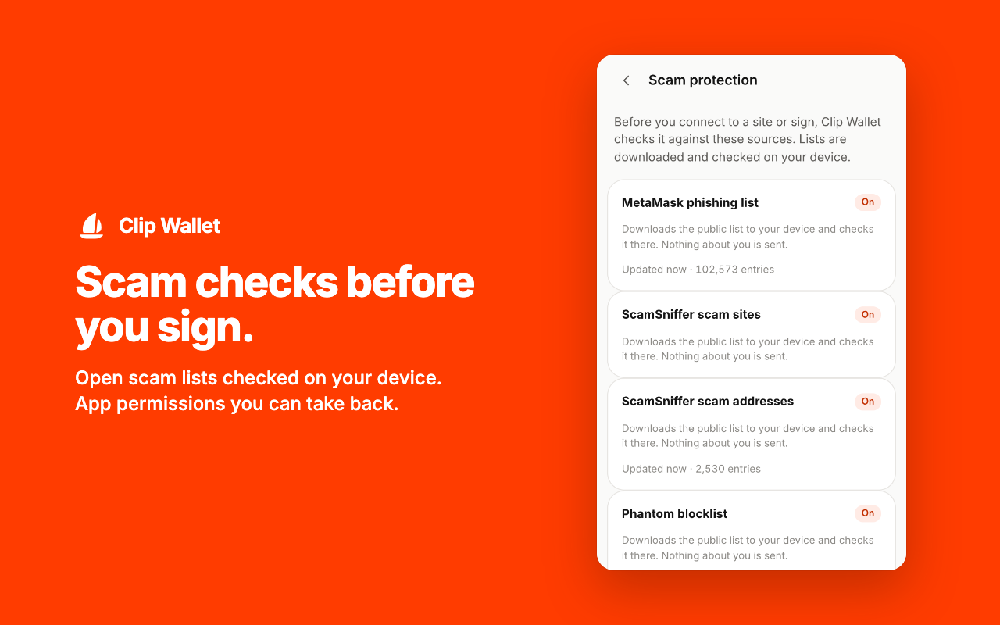
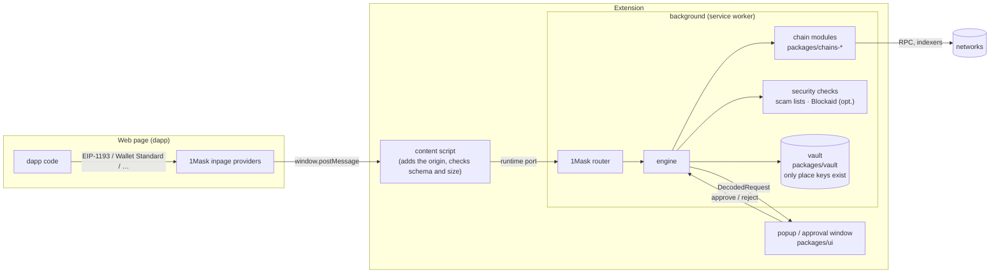
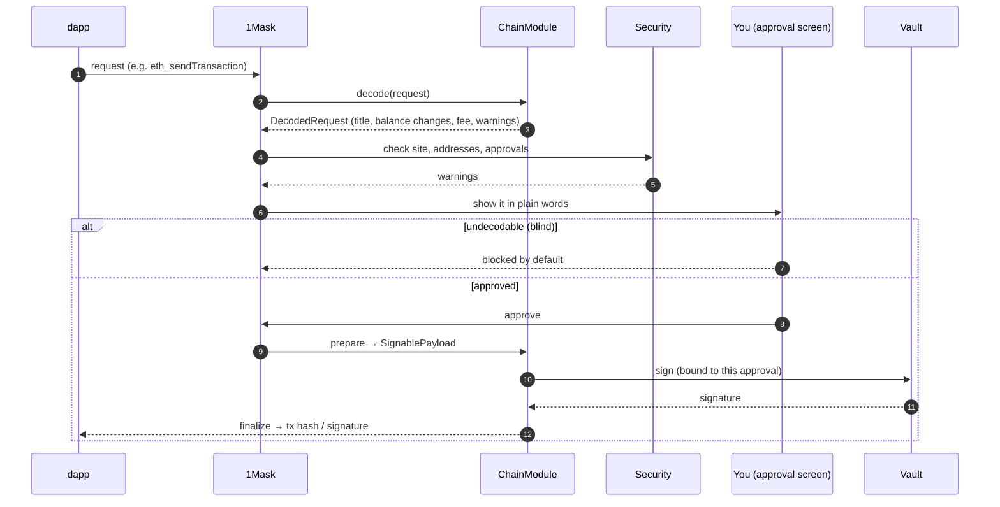
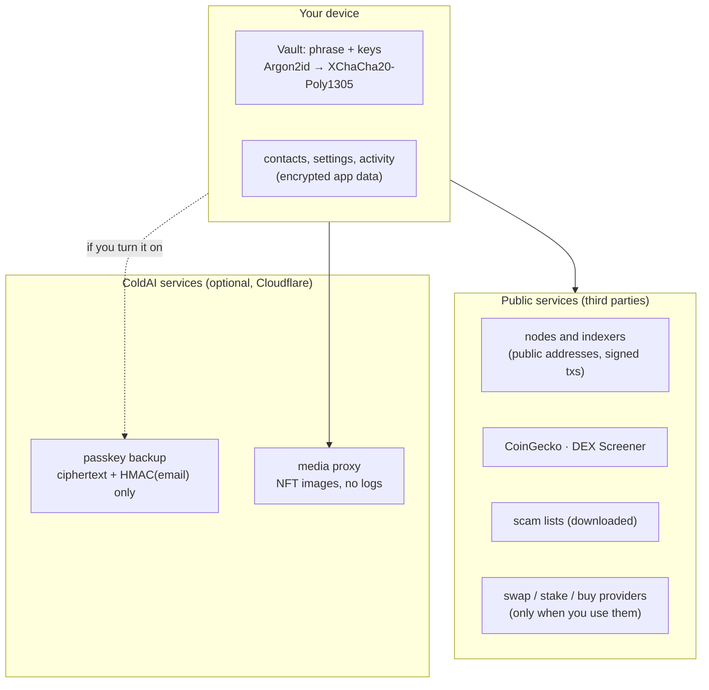

<p align="center">
  <a href="https://coldai.org">
    <picture>
      <source media="(prefers-color-scheme: dark)" srcset=".github/assets/coldai-logo-white.png">
      
    </picture>
  </a>
</p>

<p align="center">
  
</p>

<h1 align="center">Clip Wallet</h1>

<p align="center">
  <strong>A calm, non-custodial wallet for every CLPR network.</strong><br>
  One recovery phrase, one balance, and plain words before you sign anything.<br>
  Browser extension and iOS/Android app. Fourteen network families. Networks stay out of your way.
</p>

<p align="center">
  <a href="LICENSE"></a>
  
  
  
  
  
  <a href=".github/workflows/repro.yml"></a>
</p>

---

> **Pre-release. Test networks only.** Test tokens have no value. Clip Wallet has not had an external security
> audit. Don't use it with real funds.

## What it is

Most wallets make you think like a blockchain: pick a network, check a chain id, wonder why your USDC "is on the
wrong one". Clip Wallet speaks in **assets and apps** instead. It holds one recovery phrase for fourteen families
of networks, shows one balance per asset, decodes every request into plain words, and only mentions a network
where getting it wrong would lose money.

It is built on [CLPR](https://github.com/LFDT-CLPR), the bridgeless cross-ledger protocol from LF Decentralized
Trust, and on [CLPRouter](https://github.com/ColdAI-org/clprouter): when an app asks for money you hold somewhere
else, the wallet offers a route to fund it.

<p align="center">
  
  
</p>
<p align="center">
  
  
</p>

## Networks are invisible

The one design rule everything else follows ([`.harness/spec.md`](.harness/spec.md)):

| You see | You don't see |
|---|---|
| "Pay 25 USDC", "Swap on Uniswap" | "Base Sepolia", chain ids, RPCs |
| **USDC $412**: one row, merged across every network the same issuer runs on | Five USDC rows, one per chain (bridged copies never merge; they stay separate and labelled) |
| A small network chip **only** where a mistake loses money: an address valid on several networks, a bridged-only token, Advanced mode | Network pickers on every screen |
| "Where should the USDC arrive?", asked once per address and remembered | A send that silently picks a chain |

`pnpm harness` fails a change that hard-codes a network name into a default screen.

## Features

- **Fourteen network families, one phrase:** EVM (Ethereum, Base, Arbitrum, Optimism, Hedera EVM and more by chain
  id), Hedera, Solana, Bitcoin, Sui, Aptos, Cardano, Polkadot/Substrate, Starknet, TON, NEAR, Stellar, Tezos,
  Algorand.
- **Every request decoded:** title, balance changes, fee, time and warnings. Unlimited approvals and permits are
  called out. Requests the wallet can't read are **blocked by default** (no blind signing).
- **1Mask, one connector for every dapp:** EIP-1193 + EIP-6963, Solana and Sui Wallet Standard, Bitcoin (PSBT),
  Hedera, Cardano CIP-30, Polkadot, Starknet, TON Connect, NEAR, Stellar (SEP-43), Tezos (Beacon), Algorand, and
  WalletConnect v2. Modules for NEAR Wallet Selector, Stellar Wallets Kit and use-wallet in
  [`packages/kit-modules`](packages/kit-modules).
- **Security:** scam lists checked on the device (MetaMask, ScamSniffer, Phantom, polkadot-js lists), optional
  Blockaid scanning, look-alike address warnings, App permissions (see and revoke token approvals), spam cleanup.
- **Swap, stake, buy, Secure Trade (P2P):** each ends in the same approval screen.
- **Route and fund** on CLPRouter: shortfall detection, quotes with fee, p90 time, emissions and the weakest
  verification on the route.
- **Unlock and backup:** password (Argon2id), passkey unlock (WebAuthn PRF), Face ID / fingerprint on mobile,
  optional passkey backup that the server can't open, Ledger (USB/Bluetooth) and Keystone (QR).
- **Clip Plugins** (Advanced mode, off by default): SES-sandboxed transaction insights, name resolution and
  notifications, installed from npm with integrity checks.
- **12 languages**, right-to-left Arabic included, with translation QA tests (ICU, glossary, bidi isolation).
- **Your data, in the app:** Settings → Your data says exactly what stays on the device and what goes where.
- **Rebrandable:** one `clip.config.ts` (name, icon, accent, networks, routing defaults); `create-clip-wallet`
  scaffolds a branded copy.

## Architecture



Every request takes the same path, whichever connector it came from:





| Path | What |
|---|---|
| [`packages/core`](packages/core) | The contract: `ChainModule`, `DecodedRequest`, `AssetRef`, `ClipError` |
| [`packages/vault`](packages/vault) | Phrase, derivation, encryption, approval-bound signing, passkeys. The only package that touches keys |
| [`packages/1mask`](packages/1mask) | Dapp connectors for every family, the router, WalletConnect |
| [`packages/chains-*`](packages) | One `ChainModule` per family (14) |
| [`packages/engine`](packages/engine) | Wallet engine shared by the extension and the mobile app |
| [`packages/route`](packages/route) | Route and fund on CLPRouter |
| [`packages/security`](packages/security), [`features`](packages/features), [`social`](packages/social), [`plugins`](packages/plugins), [`hardware`](packages/hardware), [`names`](packages/names) | Scam checks, swap/stake/buy/trade, contacts and handles, Clip Plugins, Ledger/Keystone, name services |
| [`packages/ui`](packages/ui), [`packages/i18n`](packages/i18n) | React screens and theme tokens; translations |
| [`apps/extension`](apps/extension) | MV3 extension (WXT): Chrome, Edge, Firefox. Store kit in [`apps/extension/store`](apps/extension/store) |
| [`apps/mobile`](apps/mobile) | Expo app for iOS and Android |
| [`services/backup`](services/backup), [`services/media-proxy`](services/media-proxy) | Cloudflare Workers: passkey backup, sandboxed NFT media |
| [`brand/`](brand) | The Clip Wallet mark, wordmark and colour guidance |
| [`tools/harness`](tools/harness) | The rules coding agents and humans must pass (`pnpm harness`) |

## Quick start

Needs Node 24 and pnpm 12 (`corepack enable` or `npm i -g pnpm@12.6.0`).

```sh
git clone https://github.com/ColdAI-org/clip-wallet && cd clip-wallet
pnpm install
pnpm typecheck && pnpm test && pnpm harness      # what CI and AGENTS.md require

pnpm --filter @clip-wallet/extension dev          # Chrome with the extension loaded (WXT)
pnpm --filter @clip-wallet/extension e2e          # Playwright: real build + fixture build
pnpm --filter @clip-wallet/extension package      # store zips, SHA256SUMS (apps/extension/release/)
cd apps/mobile && pnpm ios                        # or pnpm android (dev build; see apps/mobile/README.md)
```

### Your own wallet from the kit

Everything a wallet maker changes is one file ([`AGENTS.md`](AGENTS.md) → "Rebrand"):

```ts
// apps/extension/clip.config.ts
export default defineConfig({
  name: "My Wallet",
  rdns: "com.example.wallet",          // a reverse domain you own
  icon: "./icon.svg",
  theme: { accent: "#4F46E5" },        // text on accent must reach 3:1; small accent text is derived to 4.5:1
  networks: ["evm:*", "hedera", "solana"],
  mainnet: false,
});
```

Or scaffold a separate copy: `npx create-clip-wallet my-wallet` (experimental,
[`packages/create-clip-wallet`](packages/create-clip-wallet)).

### With a Scaffold-HBAR dapp

[Scaffold-HBAR](https://github.com/hedera-dev/scaffold-hbar) apps connect through RainbowKit/wagmi, which find
Clip Wallet through EIP-6963. Nothing to install in the dapp:

```sh
npm create scaffold-hbar@latest my-dapp && cd my-dapp
yarn install
yarn next:dev                                     # http://localhost:3000; point the app at Hedera testnet (EVM chain 296)
```

With Clip Wallet loaded in the same browser, choose **Clip Wallet** in the connect dialog. Requests to Hedera's
EVM (chain 296, through the Hashio relay) are decoded and approved like any other; the HBAR balance shows once,
merged with the native Hedera account. Get test HBAR from the [Hedera portal faucet](https://portal.hedera.com).

## Security model

- **Non-custodial, one key holder.** Only `packages/vault` derives keys and signs; chain modules build and decode
  but never see keys; screens never import the vault. `pnpm harness` enforces all three.
- **At rest:** Argon2id (64 MiB, t=3) → XChaCha20-Poly1305 for the vault and app data. Passkey unlock wraps the
  vault key with HKDF over the WebAuthn PRF output. The password always keeps working.
- **Approval-bound signing:** the vault signs only the payload of the request the user approved.
- **No blind signing by default.** Undecodable requests are blocked; only in Advanced mode can you sign one, per request, after a warning.
- **Origins come from the browser, never the page:** the content script adds the origin; the page can't claim one.
- **Extension CSP:** `script-src 'self' 'wasm-unsafe-eval'` (WebAssembly for Argon2id only). Plugins run in the
  manifest sandbox page under SES with `connect-src 'none'`.
- **Supply chain:** every GitHub Action pinned by SHA, Dependabot, CodeQL, a reproducible extension build checked
  in CI, SLSA build provenance and SHA256SUMS on every release, signed tags.
- **Optional services see ciphertext and hashes only:** threat model in
  [`services/backup/README.md`](services/backup/README.md).

Report vulnerabilities privately: [SECURITY.md](SECURITY.md).

## Status

| Area | State |
|---|---|
| Extension (Chrome, Edge) | Feature-complete for testnets; unit, harness and Playwright e2e (real + fixture builds) green |
| Extension (Firefox) | Builds as MV3 and passes `addons-linter` with 0 errors; no Firefox e2e run yet; Clip Plugins left out (no offscreen/sandbox pages in Firefox) |
| Mobile (iOS, Android) | Screens and engine tested (vitest + jest-expo); no store builds yet (no EAS/signing set up), associated domain and site URL are placeholders |
| Networks | 14 families on testnets. **Mainnet is off** and gated behind a build flag and checklist |
| Passkey backup service | Deployed for testnet builds with email sign-in **off** (no provider key) and Google/Apple sign-in unconfigured |
| Store listings | Packages, listing copy, screenshots and permission justifications ready ([`apps/extension/store`](apps/extension/store)); **nothing submitted**. The passkey bridge origin in the manifest is a placeholder |
| Route and fund | Pay-on-Hedera planning on the CLPRouter testnet deployment; settle-on-Hedera orders are a planning helper only |
| Reproducible build | Extension zips byte-identical across two clean container builds on the same CPU architecture; `TREE-DIGESTS` compares across architectures |
| Security review | Internal review only. **No external audit** |
| Legal | Privacy policy and terms are **drafts awaiting legal review** ([`docs/legal`](docs/legal)) |

## Contributing

Contributions are welcome: see [CONTRIBUTING.md](CONTRIBUTING.md) (DCO sign-off required) and the
[Code of Conduct](CODE_OF_CONDUCT.md). Coding agents: start with [AGENTS.md](AGENTS.md) and [llms.txt](llms.txt).
Changes are listed in [CHANGELOG.md](CHANGELOG.md).

## License

[MIT](LICENSE) © 2026 ColdAI. "Clip Wallet" and the Clip Wallet mark are ColdAI's; see [brand/README.md](brand/README.md)
before using them in a fork. Inter (the wordmark's typeface) is © The Inter Project Authors, SIL Open Font License 1.1.

<p align="center">
  <br>
  <a href="https://coldai.org">
    <picture>
      <source media="(prefers-color-scheme: dark)" srcset=".github/assets/coldai-logo-white.png">
      
    </picture>
  </a>
  <br>
  <sub>Built by <a href="https://coldai.org">ColdAI</a></sub>
</p>
