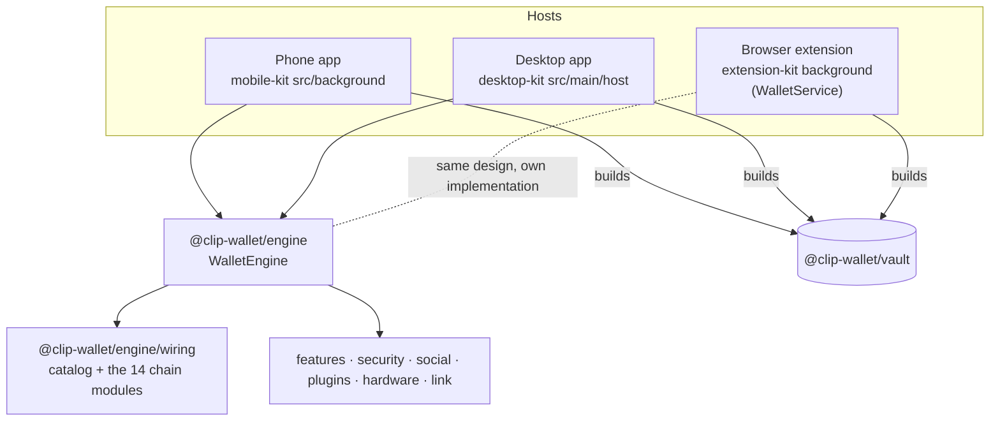

# Engine and hosts

The same wallet runs in three places: a browser extension's service worker, a React Native app and an Electron main
process. `@clip-wallet/engine` is the part that doesn't care which: approvals, per-site permissions, the portfolio
cache, send and receive (with the "network matters" question), activity, preferences, 1Mask and WalletConnect hosting,
and passkey ceremonies, all on injected seams.

## The host's job

A host provides what only it can:

| Seam | Extension | Phone | Desktop |
| --- | --- | --- | --- |
| Vault storage | `chrome.storage.local` | `expo-secure-store` (vault record), AsyncStorage (app data) | a file wrapped with Electron `safeStorage` (Keychain, DPAPI, libsecret) |
| Argon2id | WebAssembly (`hash-wasm`) | native module, with a pure-JS fallback | WebAssembly |
| Opening the approval | a popup window | a sheet | the approval window |
| Dapp origin | the browser's sender origin | the WebView's URL | the IPC sender frame's origin |
| Passkeys / biometrics | WebAuthn PRF in a page | passkeys, or a device key behind Face ID / fingerprint | Touch ID on macOS |

The host builds the vault, then hands it to the engine with `hashSignablePayload` (the engine itself never imports
the vault):

<<< @/snippets/arch/engine-host.ts

- `engine.handleUntrusted(msg)` validates every message from the screens with the same zod schema the extension's bus
  uses (`EngineRequest`).
- `engine.attachDappPort(port, senderOrigin)` wires a 1Mask port. `senderOrigin` must come from the host (browser
  sender, WebView URL, IPC frame), never from the page.
- Optional services attach afterwards: `attachFeatures`, `attachSecurity`, `attachSocial`, `attachPlugins`,
  `attachHardware`.
- The root export is light (no chain SDKs). `@clip-wallet/engine/wiring` brings in the catalogue and the chain modules,
  so tests and light hosts can skip them.

## The extension background

The extension's background (`WalletService` in
[`packages/extension-kit/src/background/service.ts`](repo:packages/extension-kit/src/background/service.ts)) came first
and the engine reimplements it on injected seams; both follow the same steps and share the catalogue
(`@clip-wallet/engine/catalog`) and the batch logic (`@clip-wallet/engine/calls-batch`). Changes to the approval path
usually belong in both. See [Extension kit](./extension-kit.md).

## The screens

`@clip-wallet/ui` is React. Screens read state and send actions through a `WalletClient`
([`packages/ui/src/client.ts`](repo:packages/ui/src/client.ts)): in the extension that is a message bus to the
background; on desktop and in tests it is `createEngineClient(engine)`. The phone app has React Native versions of the
screens on the same engine and the same message catalogue.

Screens read theme tokens only (`packages/ui/src/theme/tokens.ts`) and the wallet's name from config, so a kit-built
wallet looks and reads like itself. Every string goes through the translation layer (see
[Add a language](../extend/languages.md)).

## Tests

`pnpm --filter @clip-wallet/engine test` covers the lifecycle, the message schema, the portfolio, send with the
network-matters prompt, connect and `personal_sign` over a real 1Mask router port, reject (4001), the origin
cross-check, lock, and the real wiring on testnets only. Its vault is a test double with no keys.
