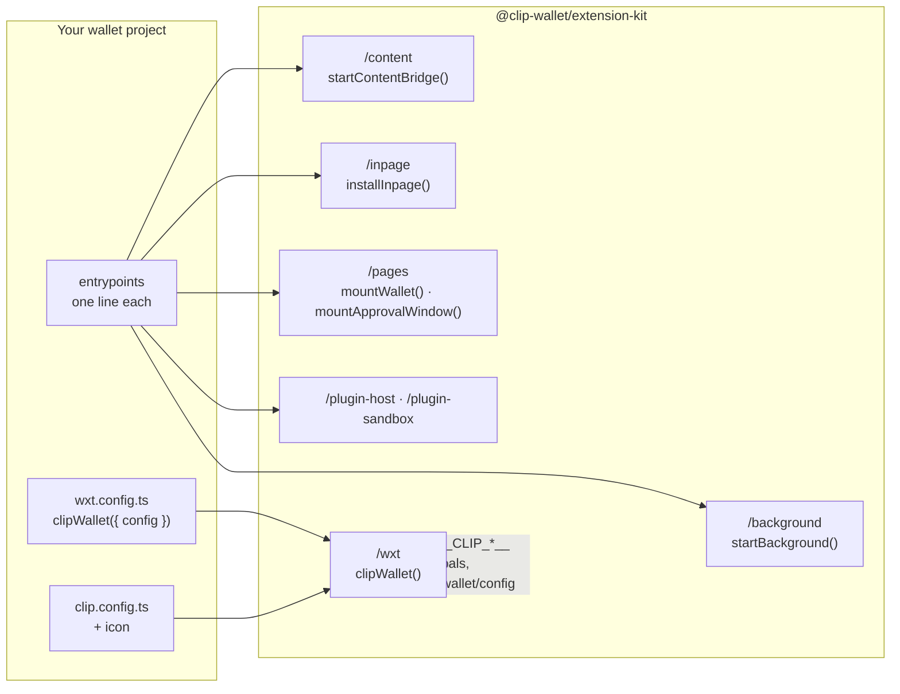

# Extension kit

`@clip-wallet/extension-kit` is the whole browser extension as a library for [WXT](https://wxt.dev): the background
(vault, approvals, security checks), the pages, 1Mask for all fourteen families and the build wiring. A wallet project,
Clip Wallet's own `apps/extension` included, keeps only its identity, its `wxt.config.ts` and one-line entrypoints.

## Entrypoints

| Entrypoint | Import | Runs in |
| --- | --- | --- |
| background | `startBackground()` from `@clip-wallet/extension-kit/background` | service worker (Chrome), event page (Firefox) |
| content | `startContentBridge()`, `CONTENT_MATCHES` from `/content` | content script, ISOLATED world |
| inpage | `installInpage()`, `CONTENT_MATCHES` from `/inpage` | content script, MAIN world |
| popup, tab | `mountWallet("popup" \| "tab")` from `/pages` | extension pages |
| approval | `mountApprovalWindow()` from `/pages` | a popup window |
| plugin host | `startPluginHost()` from `/plugin-host` | offscreen document |
| plugin sandbox | `import "@clip-wallet/extension-kit/plugin-sandbox"` | MV3 sandbox page |

`CONTENT_MATCHES` is `https://*/*` plus `http://localhost/*` and `http://127.0.0.1/*`, so dapps you run locally get
1Mask too. Ready-made entrypoints are on [Build and ship](../kit/build-and-ship.md).

## What `clipWallet()` does at build time

`clipWallet({ config, root?, env?, mocks? })` from `@clip-wallet/extension-kit/wxt` returns the WXT configuration:

- **Identity.** The manifest's name, description and `key` (which fixes the extension id) come from `clip.config.ts`;
  so do the EIP-6963 and Wallet Standard name, icon and rdns, the `window.<wallet key>` global for NEAR, Stellar and
  Algorand, the TON Connect bridge key, and the Firefox add-on id. The icon must ship inside the extension.
- **Build environment.** `CLIP_WALLETCONNECT_PROJECT_ID` and partner keys (`CLIP_0X_API_KEY`, `CLIP_JUPITER_API_KEY`,
  `CLIP_MOONPAY_*`, `CLIP_BANXA_PARTNER`, `CLIP_C14_*`, `CLIP_COINGECKO_DEMO_KEY`, `CLIP_BLOCKAID_API_KEY`) come from the
  environment or from `CLIP_*` lines in the project's `.env`. Nothing else in `.env` is read, and values are never
  logged.
- **Security floor.** The open phishing lists are always on and refreshed daily; there is no option to switch them off.
  Blockaid scanning is added only when its key is set.
- **Mainnet checklist.** A config with mainnet on is refused while `mainnetProblems()` lists anything or the project's
  `MAINNET.md` has an open box.
- **Fixture mode.** `CLIP_MOCKS=1` builds with mock chains, route and dapps and a dev simulator, for screenshots and
  tests.
- **Reproducible output.** The inpage message channel is derived from the version and `SOURCE_DATE_EPOCH`, never
  random, so two builds of one commit are byte-identical.

The resolved config reaches the pages and background as the virtual module `virtual:clip-wallet/config`; build-time
values arrive as `__CLIP_*__` globals ([`src/globals.ts`](repo:packages/extension-kit/src/globals.ts)).

## The background

`startBackground()` builds the vault on `chrome.storage.local`, the chain modules from the catalogue, the security,
features, social and plugin services, 1Mask's router and (with a project id) WalletConnect, and then `WalletService`,
which runs [the signing flow](./signing-flow.md). Its wiring is in
[`src/background/wiring.ts`](repo:packages/extension-kit/src/background/wiring.ts) and
[`src/background/real.ts`](repo:packages/extension-kit/src/background/real.ts).

## Security posture of the extension

- **CSP:** `script-src 'self' 'wasm-unsafe-eval'` (WebAssembly for Argon2id only). No remote code.
- **Origins come from the browser:** the content script adds the origin; the router cross-checks it with the
  browser's sender origin.
- **Plugins** run in the manifest's sandbox page under SES with `connect-src 'none'`, hosted by an offscreen document
  (see [Plugins](./plugins.md)).
- **Optional permissions** are asked for from a click when needed: `nativeMessaging` for Clip Desktop, notifications
  when the person turns them on.

## Changing it

Edit `packages/extension-kit/src/background/` (shared by every kit-built wallet), test in
`packages/extension-kit/test` (vitest aliases the virtual config to `test/clip.config.ts`), then run the extension's
end-to-end suite: see [Extension end-to-end](../testing/extension-e2e.md).
