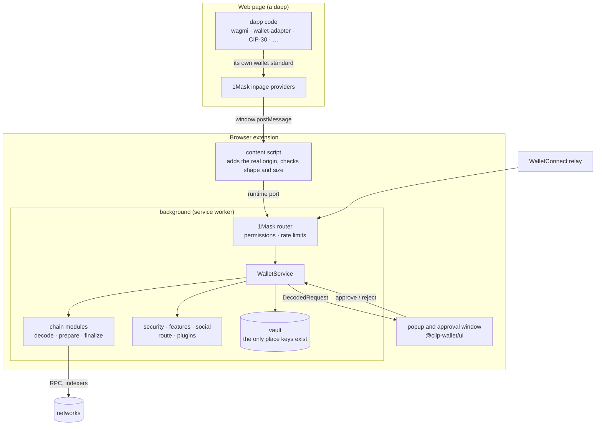

# Architecture overview

Clip Wallet is a set of small packages with one contract between them (`@clip-wallet/core`) and three hosts that put
them together: the browser extension, the phone app and the desktop app. This page is the map; the pages after it
follow one piece each.

## The big picture



The phone and desktop apps run the same pieces through `@clip-wallet/engine`: the in-app browser injects the same 1Mask
bundle, the host (React Native background, Electron main process) builds the vault and hands it to the engine, and the
screens are the same `@clip-wallet/ui` (desktop) or their React Native versions (mobile).

## Layers

| Layer | Packages | Holds keys? | Talks to the network? |
| --- | --- | --- | --- |
| Contract | `core`, `config` | No | No |
| Keys | `vault` | **Yes, only here** | No |
| Chains | `chains-*` (14) | No | Yes: RPCs and indexers of their family |
| Dapp connectors | `1mask`, `kit-modules` | No | WalletConnect relay only |
| Services in the background | `security`, `features`, `social`, `route`, `plugins`, `names`, `hardware`, `link` | No | Each says what it sends, and to whom |
| Orchestration | `engine`, `extension-kit/background` | Holds the vault object | Through the modules and services |
| Screens | `ui`, `i18n` | No | No (they ask the background) |
| Dapp SDK | `connect` | No | Only to the wallet and RPCs you pass |

## The contract

Every package agrees on the types in [`packages/core/src/index.ts`](repo:packages/core/src/index.ts):

```text
DappRequest ──ChainModule.decode──▶ DecodedRequest ──person approves──▶ ChainModule.prepare ──▶ SignablePayload[]
      ▲                                                                                              │
      │                                                                                    Vault.sign (bound to
 1Mask / WalletConnect                                                                      this approval, once)
      │                                                                                              ▼
   dapp ◀──────────────────────────── ChainModule.finalize (assemble, broadcast) ◀──────────── Signature[]
```

- `Network`, `Family` and `AssetRef` describe where things are; `AssetRef.key` merges the same asset across networks.
- `ChainModule` is the interface each family implements. See [Chain modules](./chain-modules.md).
- `Vault` is the only interface to key material. See [Vault](./vault.md).
- `ClipError` carries a plain-words `userMessage` and a stable `code`. See the [error codes](../reference/errors.md).

`core` only ever grows: fields are added as optional, never renamed or removed in a minor version.

## Read next

1. [The signing flow](./signing-flow.md): a request from the dapp to the vault and back.
2. [Networks are invisible](./networks-invisible.md): asset keys, merged balances, and when the network shows.
3. The pieces: [Vault](./vault.md), [Engine and hosts](./engine.md), [Extension kit](./extension-kit.md),
   [1Mask](./onemask.md), [Chain modules](./chain-modules.md), [Route and settle](./route-settle.md),
   [Features](./features.md), [Security services](./security.md), [Linked devices](./link.md),
   [Plugins](./plugins.md), [Social, names and hardware](./social-names-hardware.md), [Hosted services](./services.md).
