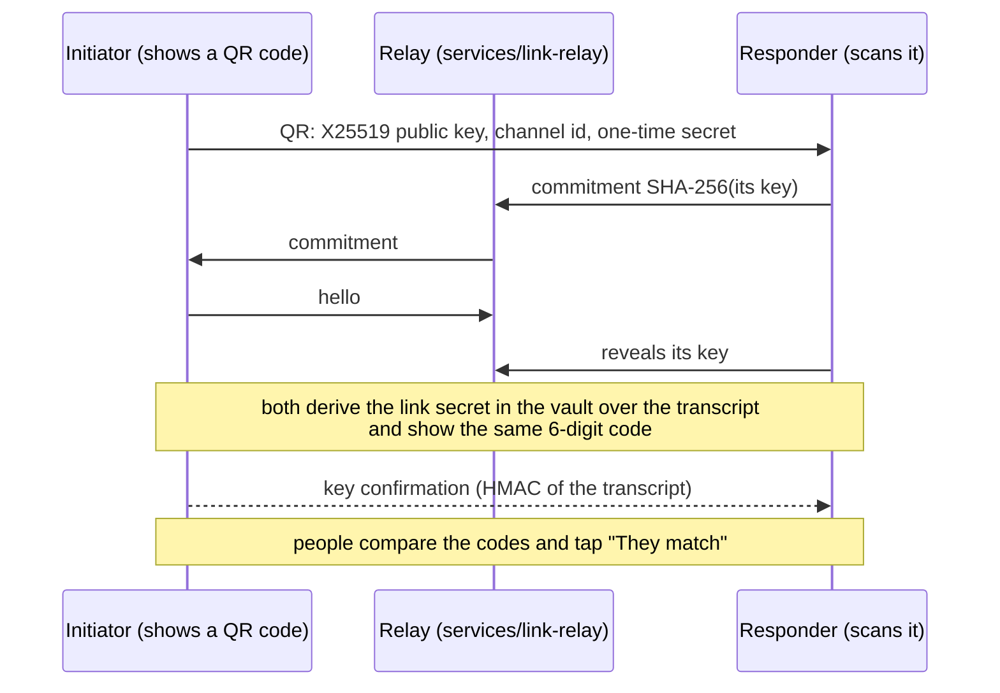

# Linked devices

`@clip-wallet/link` makes one wallet work across the browser extension, the phone and Clip Desktop: a phone or the
desktop app as the signer for the extension, end-to-end encrypted settings sync, moving a wallet to another device,
and "continue elsewhere" handoffs.

**The package holds no seed and no private key.** X25519 and Ed25519 run in the vault
([`packages/vault/src/link.ts`](repo:packages/vault/src/link.ts)); the link package gets only derived keys and handles
through the `LinkVault` interface (`syncKeys()`, `pairingKey()`, `exportToDevice()`, `importFromDevice()`).

## Pairing

- **Commit, then reveal**: the responder commits to its key before it learns the initiator's, so an attacker on the
  relay can't grind keys to force matching codes.
- **Key confirmation**: even if both people tap "match" without looking, a man in the middle fails the HMAC and
  nothing is linked.
- **Desktop**: the same protocol runs in-band over native messaging, with no QR code.

## The phone or Clip Desktop as the signer

The extension forwards a dapp's request (origin from the browser, never the page) to the paired device. That device
decodes it with its own chain modules, shows its own approval ("app.example · via Chrome on Mac") and signs only after
approval there. The extension receives exactly what a dapp would. A stolen link secret can only *ask*; the person still
approves on the key-holding device.

Sessions use AEAD with per-connection keys and strictly increasing counters: no replay, reorder or splice. The relay
sees ciphertext and frame sizes only.

## Settings sync

Contacts, account labels, connected apps, notification settings, language, currency, hidden tokens and bookmarks sync
through `services/backup`'s `/v1/sync`. Never keys, phrases, passwords, approvals or Advanced-mode settings.

- Each request is signed with an Ed25519 sync key derived from the seed; there is no account and no email.
- Records are XChaCha20-Poly1305 ciphertext with opaque ids; the server can't read, forge or move them.
- Conflicts merge per record with vector clocks; a new device takes the server's settings first.

## Moving a wallet

Adding the wallet to another device needs a "device-add" pairing, both people confirming the code, key confirmation,
**and the password re-entered on the source**. The vault encrypts the BIP-39 entropy under a key only those two
pairing keys can derive; the phrase never crosses the vault API. The passkey backup can be sent instead.

## Continue elsewhere

`clipwallet://browse?url=<https URL>&h=<token>` opens a site on another of the person's devices. The token is sealed
with a key derived from the sync key, so only a device with the same wallet opens it, only for that URL's origin,
within 10 minutes, and restoring the connection still takes a tap.

The full threat model, every key and what each side can see: [`packages/link/README.md`](repo:packages/link/README.md).
The relay itself: [Link relay](../services/link-relay.md).
