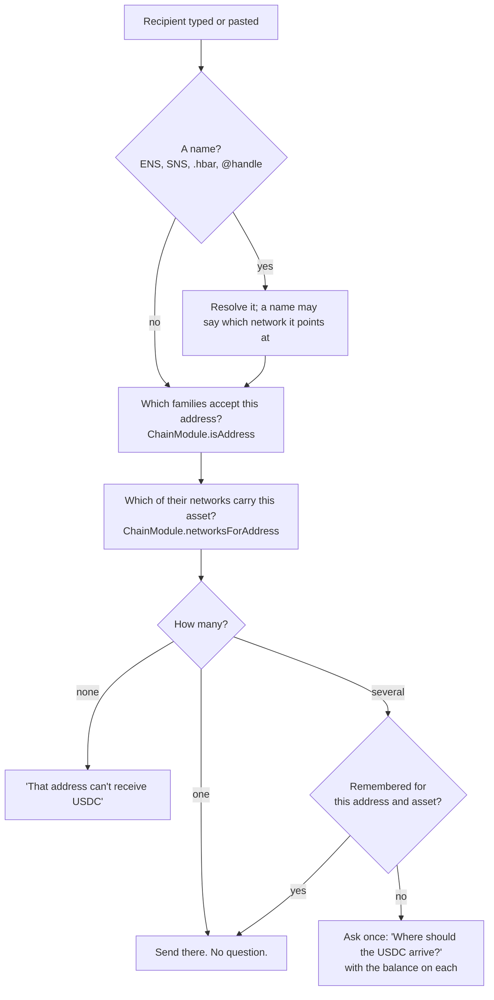

# Networks are invisible

Most wallets make people think like a blockchain: pick a network, check a chain id, wonder why their USDC "is on the
wrong one". Clip speaks in **assets and apps** instead, and shows a network only where getting it wrong would lose
money. This is the rule every screen, and every kit-built wallet, follows.

| People see | People don't see |
| --- | --- |
| "Pay 25 USDC", "Swap on Uniswap" | "Base Sepolia", chain ids, RPC URLs |
| **USDC $412**: one row, merged across every network the same issuer runs on | Five USDC rows, one per chain |
| A small network chip, only where a mistake loses money | A network picker on every screen |
| "Where should the USDC arrive?", asked once per address and remembered | A send that silently picks a chain |

## Asset keys

Every `AssetRef` has a `key`. **The same issuer's token shares one key on every network**: Circle's USDC is `"usdc"`
on Ethereum, Base, Solana, Hedera and Stellar; the native coins are `"eth"`, `"hbar"`, `"sol"` and so on.

A **bridged or wrapped copy** of an asset native elsewhere gets its **own key** and `bridged: true`. It never merges
with the real thing, because it isn't the same claim on the same issuer.

```json
[
  { "key": "usdc", "symbol": "USDC", "networkId": "eip155:84532", "address": "0x036CbD53842c5426634e7929541eC2318f3dCF7e" },
  { "key": "usdc", "symbol": "USDC", "networkId": "eip155:11155111", "address": "0x1c7D4B196Cb0C7B01d743Fbc6116a902379C7238" },
  { "key": "usdc.e", "symbol": "USDC.e", "networkId": "eip155:421614", "address": "0x…", "bridged": true }
]
```

The first two share the key `usdc` and become one "USDC" row; the bridged copy keeps its own row.

The keys come from each chain package's token tables (`CURATED_TOKENS` in `@clip-wallet/chains-evm`, the Hedera,
Solana, Sui, Aptos, NEAR, Stellar and Algorand USDC tables) and are assembled per wallet by the catalogue in
[`packages/engine/src/catalog.ts`](repo:packages/engine/src/catalog.ts), filtered by the networks in `clip.config.ts`.

## Merged balances

Home shows one row per key. `mergeBalances()` from `@clip-wallet/ui` sums the parts (scaling to the largest decimals),
adds up the fiat values, keeps bridged copies apart, and hides spam and small balances when asked:

<<< @/snippets/arch/merged-balances.ts

The per-network parts appear only on the asset's own screen. Clip Connect offers dapps the same view: `balances()`
returns balances by asset key, summed over chains (see [pay() and balances()](../connect/pay.md)).

## When the network is shown

The network chip appears in exactly these places:

1. **An address valid on several networks.** An EVM address works on every EVM chain, so sending USDC to `0x…`
   could mean Base or Ethereum. That is the `network-matters` warning. Send asks "Where should the USDC arrive?" with
   each candidate network and how much the person holds there, then remembers the answer for that address and asset.
2. **A token that exists only as a bridged copy**, labelled as such.
3. **Advanced mode**, which shows networks everywhere for people who want them.

### How Send decides

`resolveRecipient()` in the background works it out:



The background re-checks the choice when the transfer is built: it never trusts the screen's network blindly.

### Receive

Receive shows one QR code per address, labelled in plain words ("Ethereum and EVM apps"), with the networks that
address covers listed underneath.

## Dapps and networks

Dapps still choose networks; the wallet just doesn't make a fuss about it:

- `wallet_switchEthereumChain` to a network the wallet ships with **switches without a prompt** and emits
  `chainChanged`. The choice is remembered per site. Unknown chains get `4902`.
- `wallet_addEthereumChain` only switches to chains the wallet already has, and always uses the wallet's own RPC,
  never the dapp's.
- Hedera's EVM (chain `296` on testnet) is reachable whenever the wallet has Hedera.

## For kit-built wallets and screen authors

- Screens read the network only from the chip component and Advanced mode. Don't add a network name to a default
  screen: [`AGENTS.md`](repo:AGENTS.md) rule 4.
- New tokens: give each issuer's token one key across networks; give bridged copies their own key and
  `bridged: true`; test that a look-alike stays `spam`. See [Add a network or token](../extend/networks-and-tokens.md).
- New chain modules: `networksForAddress()` decides when Send has to ask, so return every network an address could
  belong to.
