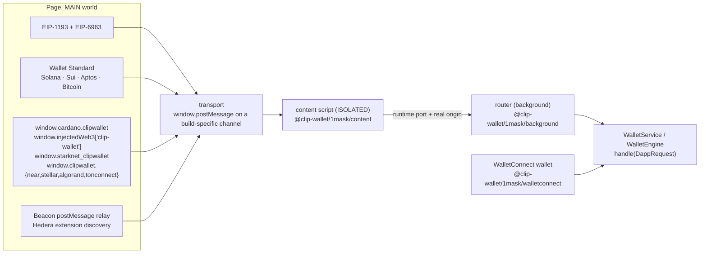

# 1Mask connectors

1Mask makes one wallet look native to every dapp. For each family it answers that ecosystem's own wallet standard, so
wagmi, the Solana wallet adapter, dapp-kit, CIP-30 libraries, `@polkadot/extension-dapp` and the rest find Clip with no
Clip-specific code. It also runs the wallet side of WalletConnect.

1Mask never touches keys and never imports the vault or a chain module. It turns dapp calls into `DappRequest`s and
hands them to the background.

## Entry points

| Import | Runs in | What it does |
| --- | --- | --- |
| `@clip-wallet/1mask/inpage` | page, MAIN world | `installOneMask(config)`: every family's provider, announced with the wallet's identity |
| `@clip-wallet/1mask/content` | content script | `createContentBridge({ channel })`: checks each message (same window, channel, schema, size) and adds its own `location.origin` |
| `@clip-wallet/1mask/background` | background | `createOneMaskRouter({ networks, handle, permissions, accountsFor, … })`: permissions, method allowlists, the per-site network, ids, timeouts, rate limits, events |
| `@clip-wallet/1mask/walletconnect` | background | `createWalletConnectWallet({ projectId, metadata, networks, addressesFor, approveProposal, handle })` on Reown WalletKit |
| `@clip-wallet/1mask` | anywhere | shared types, error codes, identity, network helpers |

In a kit-built wallet the extension kit wires all of this; you only meet these imports if you host 1Mask yourself.

## What each family exposes

| Family | Standard | Where a dapp finds it |
| --- | --- | --- |
| EVM, Hedera EVM | EIP-1193 + EIP-6963 | `eip6963:announceProvider`, rdns `org.coldai.clipwallet`. `window.ethereum` is left alone. |
| Solana | Wallet Standard | `standard:connect`, `solana:signTransaction`, `solana:signAndSendTransaction`, `solana:signMessage`, `solana:signIn` |
| Sui | Wallet Standard | `sui:signTransaction`, `sui:signAndExecuteTransaction`, `sui:signPersonalMessage` |
| Aptos | AIP-62 (Wallet Standard) | `aptos:connect`, `aptos:signMessage`, `aptos:signAndSubmitTransaction`, … |
| Bitcoin | Wallet Standard + sats-connect | `bitcoin:*` features and a `sats-connect:` provider (`getAccounts`, `signMessage`, `signPsbt`, `sendTransfer`) |
| Cardano | CIP-30 | `window.cardano.clipwallet` |
| Polkadot SDK | `injectedWeb3` | `window.injectedWeb3["clip-wallet"]` |
| Starknet | get-starknet v4 | `window.starknet_clipwallet` |
| TON | TON Connect JS bridge | `window.clipwallet.tonconnect`, bridge key `clipwallet` |
| NEAR | NEAR Connect, Wallet Selector module | `window.clipwallet.near`; answers `near-selector-ready` |
| Stellar | SEP-43 | `window.clipwallet.stellar` |
| Algorand | ARC-1 / use-wallet | `window.clipwallet.algorand` |
| Tezos | Beacon (TZIP-10) | answers Beacon's postMessage ping and pairing |
| Hedera (native) | WalletConnect, `@hashgraph/hedera-wallet-connect` | answers `hedera-extension-query` (builds with a WalletConnect project id) |

The keys come from the wallet's name: letters and digits for `clipwallet` (`walletKey()` in `@clip-wallet/config`),
and kebab-case for the Polkadot entry (`clip-wallet`). A kit-built wallet called "Acme Wallet" is
`window.acmewallet`, `window.cardano.acmewallet`, `window.starknet_acmewallet` and `injectedWeb3["acme-wallet"]`. Its
Wallet Standard wallets and EIP-6963 announcement carry its own name, icon and rdns.

The dapp-side guides are in [For dapp developers](../dapps/).

## Security properties

- Messages from other windows or frames, on the wrong channel, or that fail the schema are dropped.
- The origin always comes from the content script, and the router can cross-check it with the browser's sender
  origin. A page-supplied origin fails the schema.
- Accounts are never revealed before connect: `eth_accounts`, `wallet_getPermissions` and silent Wallet Standard
  connects return nothing.
- `eth_sign` is refused. `wallet_addEthereumChain` for an unknown chain is refused, and the dapp's RPC URL is never
  used.
- EIP-6963's announcement is checked: a v4 uuid stable for the session, the rdns, a data-URI icon, a frozen detail.

## The compatibility promise

For every connector, a change may not alter method results, events, error codes or timing a dapp library can observe.
New capabilities are additive and opt-in: the EIP-5792 methods answer only when the host passes `calls` to the router.
An end-to-end suite runs real, unmodified dapp libraries against the built extension and compares what crossed the wire
with a recorded snapshot. See [Compatibility promise](../connect/compatibility.md).

## WalletConnect

`createWalletConnectWallet` maps CAIP-25 proposals for `eip155`, `solana`, `bip122` and `hedera`: required chains it
can't serve reject the proposal; optional ones are dropped and listed for the approval screen. Session requests become
`DappRequest`s with `via: "walletconnect"`. WalletConnect Verify's verdict becomes warnings (`domain-mismatch`,
`known-scam`), and an unconfirmed app URL never becomes a real origin. The project id comes from the build environment
(`CLIP_WALLETCONNECT_PROJECT_ID`), never from source.

The full method coverage, event list and error codes per family are in the
[1Mask README](repo:packages/1mask/README.md) and the [API reference](../reference/api/1mask.md).
