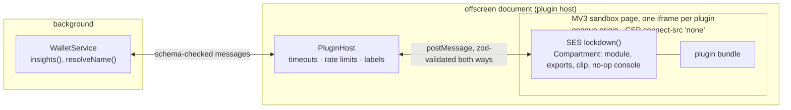

# Plugins

Clip Plugins are small extensions in the spirit of MetaMask Snaps, narrower and safety-first. A plugin can add notes
to approvals, resolve names, show a few notifications and reach up to three https origins. It can never sign, see keys
or the phrase, reach storage or call `chrome.*`: there is no permission for any of that, so a plugin can't even ask.

Plugins are **off by default**. They run only with Advanced mode on and Settings → Advanced → Plugins switched on;
turning either off stops every plugin.

## How a plugin is isolated

1. **An MV3 sandbox page, one iframe per plugin.** Chrome serves sandbox pages in a unique opaque origin with no
   extension APIs, under a CSP that forbids network, frames, workers and images.
2. **SES inside the iframe.** `lockdown()` freezes the shared intrinsics; the bundle runs in a fresh `Compartment`
   whose global holds only `module`, `exports`, a hardened `clip` object with the granted functions, and a no-op
   `console`. No `window`, `fetch`, timers, `Date.now` or `Math.random`; dynamic `import()` is refused.
3. **A schema-checked channel.** Strict, size-capped messages, validated on both sides. Output text may not contain
   control or bidi-override characters, so a plugin can't disguise an address.
4. **The host re-checks everything.** It verifies the bundle's sha256 before loading, calls only granted handlers,
   gives each call 1.5 s (two misses and the plugin is stopped), and labels everything with the plugin's name.

The host runs in an **offscreen document**, not in the approval popup, so a plugin that loops forever can only freeze
that document, and the background's timeout closes it. On the phone the same runtime runs in a hidden WebView per
plugin.

## Where plugin output appears

Notes ride **beside** the wallet's own analysis, never inside it: a separate card titled `From <plugin name>` with "not
checked by Clip Wallet" underneath. Plugins get the decoded request (never the raw payload), and never for blind
requests.

Writing one: [Write a plugin](../extend/plugins.md). The details and tests: [`packages/plugins/README.md`](repo:packages/plugins/README.md).
