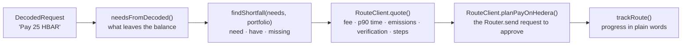
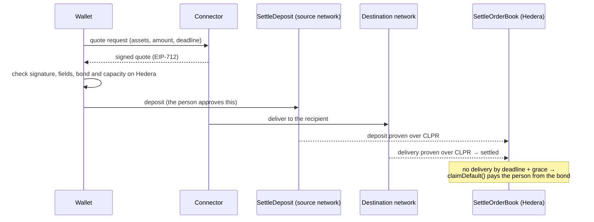

# Route and settle

When a dapp asks for money the person holds on another network, most wallets just fail. Clip finds what's missing and
offers a way to fund it, on [CLPRouter](https://github.com/ColdAI-org/clprouter) over
[CLPR](https://github.com/LFDT-CLPR). `@clip-wallet/route` holds all of it. Nothing in the package signs: it builds
`DappRequest`s that go through the normal decode and approval.

::: info Where this is today
**Phase 1** pays on Hedera from EVM balances (CLPR proofs run from a chain to Hedera today). **Settle on Hedera**
(Phase 3) is wired end to end on testnets with a test Connector. Routes that rely on test verifiers are refused
outside test networks.
:::

## From shortfall to quote

1. **Shortfall.** `findShortfall()` compares what a decoded request needs with the portfolio and returns, for each
   asset, how much is missing, the same asset on other networks (the first funding candidates) and the other balances.
2. **Quotes.** `RouteClient.quote()` asks the vendored CLPRouter planner for routes and turns each into words: what
   leaves the balance and the fee as an amount of an asset (with a USD estimate), the p90 delivery time, the emissions,
   the weakest verification on the route (a route is only as strong as its weakest hop), and the steps.
3. **Plan.** `RouteClient.planPayOnHedera()` builds the request the person approves (`Router.send` on the source
   network), with the deadline after which the money comes back.
4. **Track.** `trackRoute()` turns the CLPRouter status API into plain progress until the payment settles or is
   refunded.

The approval screen shows the shortfall ("You need 0.4 SOL more") and the quote's fee, time and steps. If no route is
possible, it says so plainly and Approve stays off.

### Routing defaults

A wallet sets its defaults in `clip.config.ts`; a person can change them:

| Setting | Meaning |
| --- | --- |
| `route.mode` | `balanced` (default), `cheapest`, `fastest`, `reliable` or `greenest` |
| `route.filters.maxHops` | at most this many hops (1 to 6) |
| `route.filters.deadlineS` | give up on routes slower than this (p90 seconds) |
| `route.filters.trustFloor` | the weakest verification a route may use |
| `route.filters.iso20022`, `mica`, `energy` | only providers with those labels; `energy` can cap kgCO2e per transaction |
| `route.filters.excludedJurisdictions` | country codes whose routers to avoid |

See the [config reference](../reference/config.md).

### Safety

- `isTestVerifier()` and `testVerifierEdges()` find hops (and the way back) that rely on test or stub verifiers. They
  are allowed on test networks only ([`src/safety.ts`](repo:packages/route/src/safety.ts)).
- Planner behaviour is the vendored CLPRouter SDK (`src/vendor/clprouter-sdk`): change it upstream and re-vendor,
  never in place.

## Settle on Hedera (Phase 3)

With `route.settleOnHedera: true`, a payment that needs money from another network also asks **bonded Connectors**
for a quote and lists the best one in the approval's details.

Before a quote is shown, `quoteConnectors()` checks that the signature recovers to a signer the order book accepts for
that Connector, that every field matches the request (assets, amount, recipient, payer, refund address, deadline,
deposit contract), and that on Hedera the Connector is registered, the cover asset is accepted and its free capacity
covers what it would owe. A quote failing any check is dropped.

In the wallet, the whole thing is **one approval**:

1. When a payment has one shortfall that the same asset on another EVM network can cover, `SettleFunding.plan`
   keeps the best verified quote, and the approval shows it.
2. The first Approve sends the exact-amount token approval (if needed) and the deposit, each through the normal decode
   and signing path.
3. The wallet follows the order on Hedera and the money on the destination network. When it arrives, the screen says
   "{amount} arrived. Approve to finish." and that Approve signs the dapp's original request.
4. If it's late, Approve becomes a one-tap claim of the cover from the bond, and Activity records the payback.

`SETTLE_DEPLOYMENTS` ([`src/phase3.ts`](repo:packages/route/src/phase3.ts)) lists the testnet deployment.
`settleOnHedera()` without options still answers "Not available yet" (`phase3`).

## Auxiliary funds for dapps (ERC-7682)

The same machinery lets Clip tell dapps, through EIP-5792's `wallet_getCapabilities`, on which chains it can bring
money in for which assets: `auxiliaryFundsFor()` builds that advertisement from the catalogue and the Connector
deployments, never from the person's balances. Whether one payment can be funded is decided when it arrives. See
[Wallet calls (EIP-5792)](../connect/wallet-calls.md).
