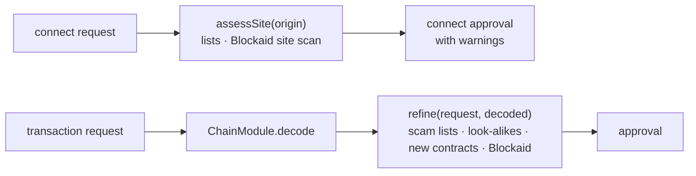

# Security services

`@clip-wallet/security` holds the checks people expect from a modern wallet, as background services with no keys:
scam detection, app permissions (see and revoke standing approvals) and spam cleanup. Every action it takes, such as
a revoke, is an ordinary `DappRequest` on the normal approval path. The screens live in `packages/ui/src/security/`.

| Area | Module | What it does |
| --- | --- | --- |
| Scam detection | `threat/` | Consulted on connect (sites) and after decode (transactions): open lists, local heuristics, optional Blockaid |
| App permissions | `approvals/` | Lists every standing permission (EVM allowances, `setApprovalForAll`, Permit2; Solana delegates; Hedera allowances) with risk flags, and revokes several in one approval |
| Spam cleanup | `cleanup/` | Solana: close empty token accounts and burn-and-close spam (rent comes back). Hedera: dissociate unused tokens. Elsewhere: hide on this device |
| Floor | `host.ts` | `securityFloorProblems()` / `assertSecurityFloor()`: what a mainnet configuration may not switch off |

## Where it sits in the flow

`refine()` never throws and never removes a module's warnings; it only adds `phishing-site`, `known-scam`,
`address-poisoning`, `malicious-transaction` or a new-contract caution. WalletConnect Verify's verdict stays in 1Mask,
and the open lists feed its `isKnownScam`.

## What leaves the device

| Source | What is sent |
| --- | --- |
| Open lists (MetaMask, ScamSniffer, Phantom, PolkadotJS) | Only a download of the list files from GitHub. Matching runs on the device. |
| Local heuristics | Nothing, except the new-contract check, which asks the network's Blockscout about the **contract** being called. Never your address. |
| Permission scan | Your address, to the same RPCs and indexers the wallet already uses for balances. |
| Blockaid | **Off unless a key is configured.** Then the site, the transaction and your address go to Blockaid for each request you review. Settings → Security says so. |

Every source says this about itself in Settings → Security, in the person's language.

## The floor

The open lists, decode-before-approve and the new-contract and look-alike checks have no switch. In a test build they
are simply on; for a mainnet build, `securityFloorProblems()` lists anything a configuration tries to lower, and the
build refuses it:

<<< @/snippets/security/security-floor.ts

More on the checks and on writing a new source: [Phishing and scam checks](../security/scam-checks.md) and
[Add a scam-check source](../extend/threat-provider.md).
