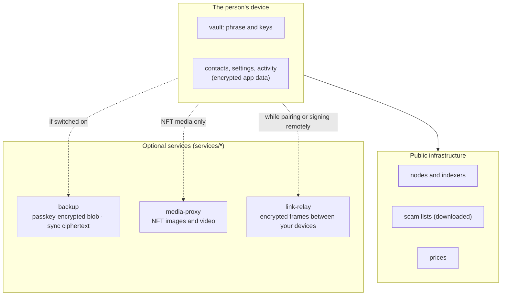

# Hosted services

Clip Wallet works with no server of its own. Three optional Cloudflare Workers add features that need one; each sees
ciphertext or public data only, and each is off until a wallet's `clip.config.ts` points at a deployment.

| Service | Config key | What it does | What it can see |
| --- | --- | --- | --- |
| [Backup](../services/backup.md) | `services.backupUrl` | Stores the passkey-encrypted backup; settings sync (`/v1/sync`) | Ciphertext, an HMAC of the email, passkey credential ids |
| [Media proxy](../services/media-proxy.md) | `services.mediaProxyUrl` | Fetches untrusted NFT media so the wallet never does | The media URLs requested, and the client IP for rate limits |
| [Link relay](../services/link-relay.md) | `services.linkRelayUrl` | Forwards encrypted frames between paired devices | Ciphertext, frame sizes and timing |

Without `mediaProxyUrl`, NFT media show placeholders and nothing remote is fetched. Without `backupUrl`, passkey backup
and sync say they aren't available. Without `linkRelayUrl`, phone pairing and moving a wallet are hidden.

How to run your own: [Services](../services/).
