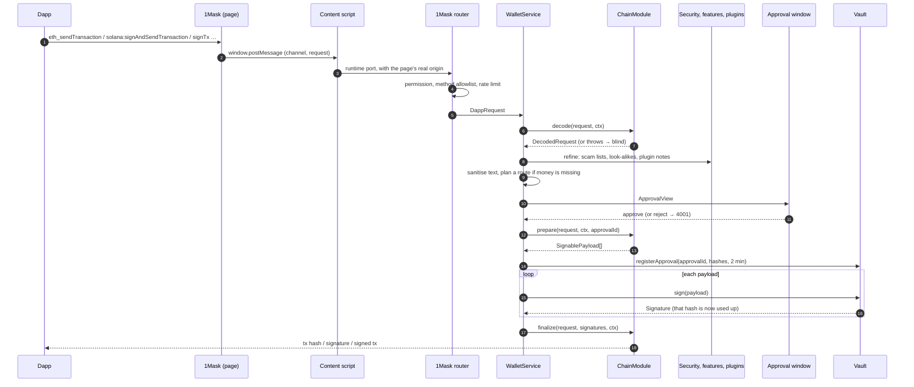

# The signing flow

Every request takes the same path, whichever dapp library sent it and whichever of the fourteen families it is for:
**request → decode → sanitise → approval → single-use signing**. This page follows one request end to end and points
at the code for each step.



## 1. The request arrives

A dapp calls its own standard: `provider.request({ method: "eth_sendTransaction" })`, a Wallet Standard feature,
`api.signTx()` on CIP-30, and so on. 1Mask's inpage provider for that family turns it into a message on a private
`window.postMessage` channel.

The **content script** ([`packages/1mask/src/content`](repo:packages/1mask/src/content)) accepts only messages from
the same window, on the build's channel, that pass a strict schema and a size cap. It then attaches **its own**
`location.origin`. A page can never claim an origin: a page-supplied `origin` field fails the schema, and the router
cross-checks the content script's origin against the browser's `port.sender.origin`.

The **router** ([`packages/1mask/src/background/router.ts`](repo:packages/1mask/src/background/router.ts)) checks the
per-site, per-family permission (a site sees accounts only after it connected), the method allowlist, the site's
current network, pending-request and rate limits, and timeouts. Read-only calls (`eth_call`, `eth_getBalance`…) go
straight to the network. Everything that needs the person becomes a `DappRequest`:

```json
{
  "id": "5f0c…",
  "origin": "https://app.example",
  "via": "injected",
  "family": "evm",
  "networkId": "eip155:84532",
  "method": "eth_sendTransaction",
  "params": [{ "from": "0x…", "to": "0x…", "value": "0x2386f26fc10000" }]
}
```

WalletConnect requests arrive the same way from the relay, with `via: "walletconnect"`. An app's self-declared URL
that WalletConnect Verify didn't confirm becomes a pseudo-origin (`https://<host>.unverified.invalid`), so it can't
borrow a real site's permissions.

## 2. Decode

`WalletService` ([`packages/extension-kit/src/background/service.ts`](repo:packages/extension-kit/src/background/service.ts))
finds the chain module for the request's family and calls `decode(request, ctx)`. The module returns a
`DecodedRequest`: a title ("Send 25 USDC to 0x12…ab"), lines, balance changes, the fee, warnings, and `blind`.

If the module can't read the request, it either returns `blind: true` or throws. A throw also makes the request blind,
and if it was a `ClipError` its plain-words reason ("You don't have enough BTC…") is attached as a warning
(`decodeFailureReason()` in `@clip-wallet/core`), so the person isn't told only "can't read this".

Then other services **refine** the decode, never replacing the module's warnings:

- `features` re-checks requests the wallet built itself (swaps, staking) against their bytes;
- `social` labels contacts and handles;
- `security` adds phishing-site, known-scam, address-poisoning and new-contract warnings, and Blockaid's verdict when
  a key is configured. See [Security services](./security.md).

The background adds a `domain-mismatch` caution for any site it doesn't recognise. Clip Plugins may add notes in a
separate, labelled card, and never for blind requests (see [Plugins](./plugins.md)).

## 3. Sanitise

Text in a decode comes from chains, dapps and indexers: token names, NFT names, memos, app names. Before anything is
shown, `sanitizeDecoded()` passes every human-readable string through `displaySafe()`, which removes invisible and
direction-changing characters (such as U+202E RIGHT-TO-LEFT OVERRIDE) that could make the screen say something other
than what the request does.

<<< @/snippets/arch/display-safe.ts

More in [Sanitising what you see](../security/sanitization.md).

## 4. Plan, then ask

If the request needs money the person holds somewhere else, `@clip-wallet/route` finds the shortfall and plans a way
to fund it (see [Route and settle](./route-settle.md)). Blind requests are never planned.

The approval window shows the decoded request in plain words. The network appears only as a small chip, where it
matters. Advanced mode can show the raw request too.

- **Reject** answers the dapp with its standard "user rejected" error (EIP-1193 `4001`, and each ecosystem's
  equivalent).
- **Approve** on a **blind** request is refused (`approval/blind-blocked`) unless Advanced mode is on and the person
  overrides it for that request, after a warning.
- One Approve at a time: a second click while the first is signing is refused, so nothing is broadcast twice.
- If the site's account changed after the request arrived, the request is refused rather than signed with an account
  the person never saw in it (`approval/account-changed`).

## 5. Prepare and bind

After approval, the module's `prepare(request, ctx, approvalId)` returns the `SignablePayload`s: the exact bytes to
sign, the scheme (`ecdsa-secp256k1`, `ed25519`, `sr25519`…) and the account.

The background then calls `vault.registerApproval(approvalId, hashes, ttl)` with one hash per payload
(`hashSignablePayload()`: SHA-256 over the account id, scheme, bytes and any sub-path, each length-prefixed). The
approval lives two minutes.

## 6. Sign, once

`vault.sign(payload)` signs only if:

- the approval is live (its time-to-live is capped at 10 minutes);
- the payload's hash is registered for it and **not yet used**;
- the scheme is one the account's family allows (Substrate only sr25519, Starknet only stark-ecdsa…);
- any key below the account (a Bitcoin change key, the Cardano stake key) is one the vault handed out for it.

Each hash signs exactly once. An approval for three payloads allows three signatures and then disappears. Locking the
wallet clears every approval. If anything fails, the background revokes the approval. Details:
[Approval-bound signing](../security/approval-signing.md).

## 7. Finalize

`finalize(request, signatures, ctx)` assembles the signed transaction or message, broadcasts it if the method asks
for that, and returns what the dapp's standard expects: a transaction hash, a signature, a signed transaction. The
activity list gets an entry in plain words ("Paid 25 USDC to app.example").

## The whole path in one function

Reduced to its steps, the background does this (the real code also handles security checks, plugins, routes,
hardware wallets and batches):

<<< @/snippets/arch/pipeline.ts

## Variations

**The wallet's own requests.** Send, staking, swaps and Secure Trade build a `DappRequest` with
`origin: "clip-wallet"` (`WALLET_ORIGIN`) and go through the same decode and approval. A site can't pose as the wallet:
dapp origins are always URLs.

**Hardware wallets.** For a Ledger or Keystone account, the approval registers the payloads with the
`HardwareKeyring` instead of the vault. The device shows and signs the full message (`SignablePayload.raw`), and the
keyring accepts a signature only if it verifies over the approved bytes with the account's key, once. See
[Hardware wallets](../security/hardware.md).

**Batches (EIP-5792 `wallet_sendCalls`).** Every call in the batch goes through the full decode pipeline, then one
approval shows them all. The calls then run one after another. Batches with hardware accounts are refused for now.
See [Wallet calls](../connect/wallet-calls.md).

**Another device signs.** With a linked phone or Clip Desktop as the signer, the extension forwards the request; the
key-holding device decodes it with its own chain modules, shows its own approval and signs. See
[Linked devices](./link.md).
