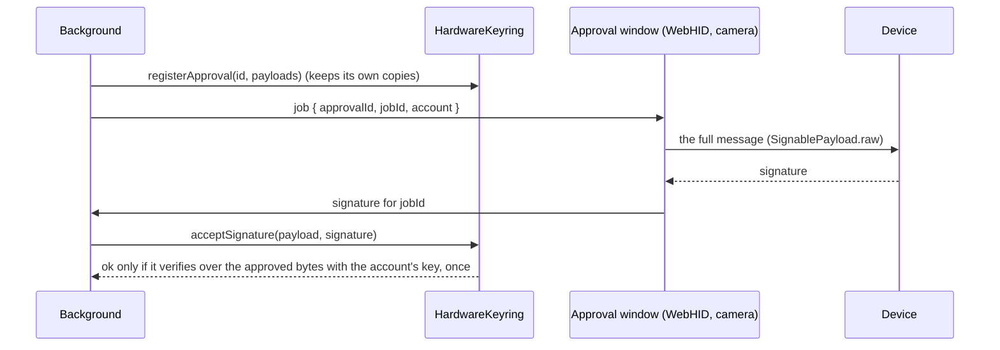

# Social, names and hardware

Three smaller packages round out the wallet. None of them holds keys.

## Social (`@clip-wallet/social`)

Background services for the people side of a wallet. Hosts build a `SocialService`; screens use its views over the
message bus.

- **Contacts.** An address book, encrypted with the vault's app-data key and synced between linked devices. Contacts
  are the first suggestion in Send.
- **Clip handles.** `@name` handles on Hedera, from the `ClipHandles` contract (`contracts/handles`). Lookups read
  through Hedera's JSON-RPC relay; registering one is a normal approval that writes a public record (the
  `public-record` warning says so). Off until `services.clipHandles` is set in `clip.config.ts`.
- **Notifications.** Received payments and other events, rate-limited. The browser asks for permission when the person
  turns them on, never at install.
- **Discover.** Market data for the assets the person holds or watches.

## Names (`@clip-wallet/names`)

Turns a name into an address and the network it implies, so Send's "network matters" question knows where a name
points: ENS (`alice.eth`), SNS (`alice.sol`), Hedera names (`alice.hbar`), Clip handles, and names that a Clip Plugin
resolves. Read-only.

<<< @/snippets/arch/names.ts

A name may publish different addresses per network (ENS per-chain records, a handle per family); the background uses
the one for the network it sends on.

## Hardware (`@clip-wallet/hardware`)

Accounts that live on a hardware wallet. The key never enters Clip: it stores public keys and paths, the device signs,
and every signature is checked against the exact bytes the person approved before it is used.

| Device | Connection | Families |
| --- | --- | --- |
| Ledger | USB (WebHID) in the extension and desktop; Bluetooth on the phone | EVM, Solana, Bitcoin, Hedera |
| Keystone | QR codes (animated BC-UR), fully air-gapped | EVM, Solana, Bitcoin |

Devices show and sign the full transaction or message, never a bare digest: chain modules attach it as
`SignablePayload.raw`, and the keyring checks that `raw` produces the approved bytes before the device sees it. Hardware
account ids (`hw:<kind>:<fingerprint>:<family>:<index>`) can never be mistaken for vault ids, so a hardware account can't
be routed to the vault by accident.

Details per device, derivation layouts and the device recordings the tests replay:
[`packages/hardware/README.md`](repo:packages/hardware/README.md). The security angle: [Hardware wallets](../security/hardware.md).
