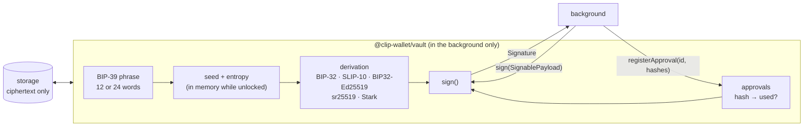

# Vault

`@clip-wallet/vault` is the only package that touches recovery phrases and private keys. It implements the `Vault`
interface from `@clip-wallet/core` as `ClipVault`: create or import a phrase, derive accounts for fourteen families,
encrypt everything at rest, and sign only what the person approved.

## What it does

| Area | API |
| --- | --- |
| Lifecycle | `status()`, `create(password)`, `importPhrase(phrase, password)`, `unlock(password)`, `lock()`, `changePassword()`, `reset()` |
| Onboarding and backup only | `revealPhrase(password)` (the onboarding screen is the one screen allowed to call it) |
| Accounts | `deriveAccount(family, index)`, `listAccounts()`, `addAccount()`, `setAccountLabel()` |
| Bitcoin change | `freshChange()`, `deriveChange()`, `listChange()` |
| Signing | `registerApproval(approvalId, hashes, ttlMs)`, `revokeApproval()`, `sign(payload)` |
| Passkeys | `enrollPasskey()`, `unlockWithPasskey()`, `listPasskeys()`, `removePasskey()`, `createPasskeyBackup()`, `restorePasskeyBackup()` |
| App data | `sealAppData(namespace, data)`, `openAppData(namespace, sealed)`: contacts and other private settings, encrypted under a key tied to the seed |
| Linked devices | `syncKeys()`, `pairingKey()`, `exportToDevice()`, `importFromDevice()` |

## Derivation

One phrase derives every family. The paths match what each ecosystem's popular wallets use, so the same phrase shows
the same addresses:

| Family | Curve | Path (account `i`) | Compatible with |
| --- | --- | --- | --- |
| evm | secp256k1 | `m/44'/60'/0'/0/i` | MetaMask, Rabby |
| hedera | secp256k1 | `m/44'/3030'/0'/0/i` | Hiero SDK standard ECDSA |
| solana | ed25519 | `m/44'/501'/i'/0'` | Phantom, Solflare |
| bitcoin | secp256k1 | `m/84'/c'/0'/0/i` (taproot `m/86'/…`) | Sparrow, BlueWallet |
| sui | ed25519 | `m/44'/784'/i'/0'/0'` | Sui Wallet / Slush |
| aptos | ed25519 | `m/44'/637'/i'/0'/0'` | Petra |
| cardano | BIP32-Ed25519 (CIP-3 Icarus) | `m/1852'/1815'/i'/0/0` | Eternl, Lace, Yoroi |
| substrate | sr25519 | root, then `//(i-1)` | polkadot.js, Talisman |
| starknet | Stark | `m/44'/9004'/0'/0/i` (Argent X scheme) | Argent X; Braavos and Ledger schemes as options |
| ton | ed25519 | `m/44'/607'/i'` (wallet v5r1) | Tonkeeper BIP-39 import |
| near | ed25519 | `m/44'/397'/i'` | near-seed-phrase |
| stellar | ed25519 | `m/44'/148'/i'` (SEP-0005) | Stellar wallets |
| tezos | ed25519 | `m/44'/1729'/i'/0'` | Temple, Kukai |
| algorand | BIP32-Ed25519 (ARC-52) | `m/44'/283'/i'/0/0` | Pera Universal Wallet |

The [vault README](repo:packages/vault/README.md) gives the source for every row and the cases where wallets disagree
(Hedera key types, Algorand's three schemes, TON's native mnemonics, Starknet's account schemes).

Network-dependent encodings default to **testnet** (`bitcoinNetwork`, `cardanoNetwork`, `tonNetwork`).

## At rest and in memory

The password goes through Argon2id to a key that wraps a random vault key; the vault key encrypts the phrase's
entropy with XChaCha20-Poly1305. Passkeys wrap the same vault key through the WebAuthn PRF extension. While unlocked,
only the seed and entropy are in memory; derived private keys are wiped after each call, and `lock()` wipes everything.
See [Vault cryptography](../security/vault-crypto.md).

## Using it from a host

Only hosts may import it: the extension background, the mobile background, the desktop main process and the onboarding
screen. Everything else asks the background through messages. A host builds one `ClipVault` with its storage
(`chrome.storage.local` in the extension, the secure store on the phone, a `safeStorage`-wrapped file on desktop) and
passes it to the wallet service or engine, with `hashSignablePayload` for the approval hashes.

The background's part of the signing flow, step by step, is on [The signing flow](./signing-flow.md); the guarantees
`sign()` enforces are on [Approval-bound signing](../security/approval-signing.md).

## Tests

`pnpm --filter @clip-wallet/vault test` runs the official BIP-39, BIP-32 and SLIP-10 vectors, address known-answer
tests for the public "abandon … about" phrase in every family, and cross-checks against each ecosystem's own SDK
(listed in the [vault README](repo:packages/vault/README.md#tests)). Tests use public test vectors only and never
generate keys.
