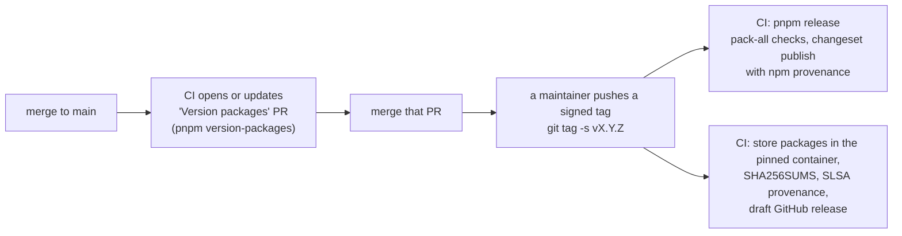

# Changesets and releases

All published packages (`@clip-wallet/*` and `create-clip-wallet`) move together at **one version**, so a kit-built
wallet pins one version of the kit. They are released **only by CI**, never from a laptop.

## Every change to a published package needs a changeset

```sh
pnpm changeset
```

Pick the packages, pick patch, minor or major, and write one plain sentence for the changelog. The changeset goes in
`.changeset/` with your change. (While all packages are `fixed` together, any changeset bumps them all.)

`@clip-wallet/core` only grows: add optional fields, never rename or remove one in a minor version.

## How a release happens



1. **Version packages.** On every push to `main`, CI opens or updates a "Version packages" pull request:
   `pnpm version-packages` runs `changeset version`, then `tools/release/sync-template.mjs` pins the Scaffold-HBAR
   template (and create-clip-wallet's bundled copy) to the new version.
2. **A signed tag.** After that pull request merges, a maintainer pushes an annotated, signed tag
   (`git tag -s vX.Y.Z -m "Clip Wallet vX.Y.Z"`). The workflow refuses an unsigned or unverified tag, a version that
   differs from `apps/extension/package.json`, a missing `## [X.Y.Z]` section in `CHANGELOG.md`, and a tree with pending
   changesets.
3. **Publish.** The tag runs `pnpm release`: `pnpm pack-all` (build, manifest checks, tarball checks) and
   `changeset publish`, with npm provenance, so every tarball carries a Sigstore-signed attestation naming the
   repository, the workflow and the commit. Versions already on npm are skipped.
4. **Store packages.** The same tag builds the extension's store zips in the reproducible-build container, writes
   `SHA256SUMS`, attests SLSA provenance and opens a **draft** GitHub release. Nothing is uploaded to any store
   automatically.

## Check locally

```sh
pnpm pack-all     # builds and packs everything into .packs/ and checks each tarball; publishes nothing
pnpm kit:e2e      # a kit-built wallet from those tarballs
```

Never run `npm publish` or `pnpm publish` by hand.

## Changing a package's manifest

Exports point at `./src/…` under the `development` condition; `node tools/release/normalize-manifests.mjs` writes the
rest (dist targets, `publishConfig` with provenance, `files`, repository, engines). Every runtime import must be a
dependency or a peer: `node tools/release/check-manifests.mjs`, part of `pnpm harness`, checks it.
