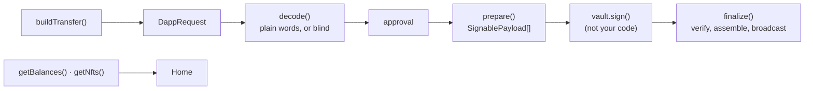

# Write a chain module

A chain module teaches Clip Wallet one family of networks. This page builds a complete one, step by step, for
**Example Ledger**: a made-up account-based ed25519 network with a small JSON-RPC API. Everything on this page compiles
against the real `@clip-wallet/core`, and the docs' test suite runs the module: it decodes, prepares, refuses a bad
signature and reads balances.

::: tip Adding a network to an existing family?
That doesn't need a module: see [Add a network or token](./networks-and-tokens.md). A module is for a new family.
:::

## What you're building

Your module never sees a key. It says what must be signed; the vault signs it if the person approved; your module
checks the signature and sends.

## 1. The package and the family

1. Create `packages/chains-<family>` with a `package.json` that depends on `@clip-wallet/core` (never the vault) and a
   `tsconfig.json` copied from another chain package. Run `node tools/release/normalize-manifests.mjs` to give it the
   published manifest shape.
2. Add the family to `Family` and `FAMILIES` in `packages/core/src/index.ts` (additive), and to `NETWORK_FAMILIES` in
   `packages/config/src/index.ts`.
3. Describe its networks. Each has a CAIP-2 style id, a native asset with an asset key, and is a testnet unless it
   isn't:

<<< @/snippets/extend/example-module.ts#network

## 2. Helpers: parse, format, call the network

Validate the dapp's params yourself and throw a `ClipError` with plain words when something is wrong. If `decode()`
throws a `ClipError`, the approval is blocked as unreadable and shows your reason, so make it useful ("This payment's
recipient isn't an Example Ledger address", not "invalid params").

<<< @/snippets/extend/example-module.ts#helpers

Use `ctx.fetch`, never the global: hosts pass their own (and tests pass a fake).

## 3. Keys and addresses

<<< @/snippets/extend/example-module.ts#keys

`networksForAddress()` decides when Send asks "Where should it arrive?": return every network the address could
belong to. One answer means no question.

## 4. Reads

<<< @/snippets/extend/example-module.ts#reads

Return balances in base units as decimal strings, with the asset's key. Same issuer, same key across networks;
bridged copies get their own key and `bridged: true` (see [Networks are invisible](../architecture/networks-invisible.md)).

## 5. Decode

This is the heart of the module: turn the request into what the person reads before approving.

<<< @/snippets/extend/example-module.ts#decode

- **The title** says what happens, with the amount, asset and counterparty ("Send 1.5 EXM to ex1abab…abab").
- **Balance changes** are signed base units, fee included; the screen formats them.
- **Warnings** carry a code from `WARNING_CODES`. Use the codes in the [warning reference](../reference/warnings.md);
  `danger` is for "this can lose you everything".
- **Simulate** where the network can dry-run, and set `simulated: true`. A failed preview is a `simulation-failed`
  warning, never silence.
- **Unreadable is blind.** Never guess.

## 6. Prepare

After approval, return exactly what the vault must sign. Remember what you built (by request id), so `finalize()` sends
the very bytes that were signed.

<<< @/snippets/extend/example-module.ts#prepare

The vault refuses a payload whose scheme the family doesn't allow, or whose hash wasn't registered for this approval,
so `scheme` must match the family's entry in the vault (step 8).

## 7. Finalize

Check the signatures before you send anything, then assemble and broadcast. Return what the dapp's standard expects.

<<< @/snippets/extend/example-module.ts#finalize

Verifying with `@noble/curves` is public-key maths and is allowed outside the vault. Signing is not.

## 8. Transfers from the wallet

Send in the wallet builds a request like a dapp's, with `origin: WALLET_ORIGIN`, so it goes through the same decode and
approval:

<<< @/snippets/extend/example-module.ts#transfer

## 9. Wire it in

The module alone isn't reachable yet. Each of these is a small, additive change:

| Where | What |
| --- | --- |
| `packages/vault` | derivation for the family (`src/derive.ts`), its allowed schemes (`FAMILY_SCHEMES` in `src/vault.ts`), address encoding, and known-answer tests from the public test phrase |
| `packages/engine/src/catalog.ts` | its networks and assets in the catalogue |
| `packages/engine/src/wiring.ts`, `packages/extension-kit/src/background/wiring.ts` | `create<Family>Module` in the module table |
| `packages/1mask` | an inpage provider for the family's own dapp standard, router methods, and WalletConnect namespaces if it has them |
| `packages/core/src/messages` | translatable versions of your module's sentences (optional: English works without them) |
| `packages/ui` | receive labels and any family-specific screens |

## 10. Test it

- Unit tests with fixtures: decode every request shape you support, including the unreadable ones.
- Signatures in fixtures are **precomputed offline** from the public "abandon … about" test account. Never generate
  or embed keys in tests: `pnpm harness` fails on key APIs outside the vault and on phrase literals.
- A row in the [dapp matrix](../testing/matrices.md) once a testnet and a dapp library exist.

Then the usual: `pnpm typecheck && pnpm test && pnpm harness`, and a changeset.

## The whole file

<<< @/snippets/extend/example-module.ts
