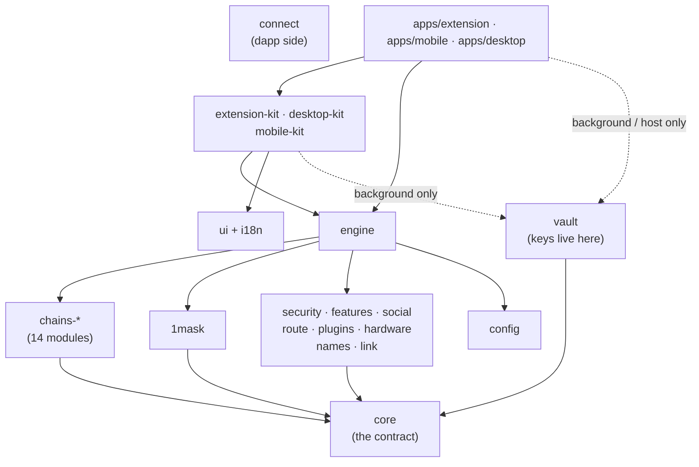

# Repository layout

Everything lives in one pnpm workspace: `packages/*`, `apps/*` and `services/*`. Every package under `packages/` is
published to npm as `@clip-wallet/<name>` (plus `create-clip-wallet`), all at one version.

## Packages

| Path | What it is |
| --- | --- |
| `packages/core` | The contract: `Family`, `Network`, `AssetRef`, `ChainModule`, `DappRequest`, `DecodedRequest`, `SignablePayload`, `ClipError`, warning and error codes. Additive changes only. |
| `packages/config` | The `clip.config.ts` schema (zod): identity, theme, networks, routing, services, the mainnet checklist. |
| `packages/vault` | Recovery phrase, key derivation for 26 families, encryption at rest, approval-bound signing, passkey unlock. **The only package that touches keys.** |
| `packages/chains-*` | One `ChainModule` per family: `evm`, `hedera`, `solana`, `bitcoin`, `sui`, `aptos`, `cardano`, `substrate`, `starknet`, `ton`, `near`, `stellar`, `tezos`, `algorand`. |
| `packages/1mask` | Dapp connectors for every family, plus WalletConnect. Announces the wallet's identity. |
| `packages/engine` | Environment-free orchestration (approvals, permissions, portfolio, catalog) shared by mobile and desktop. |
| `packages/extension-kit` | The browser extension as a library: background, pages, WXT build (`clipWallet()`), security floor. |
| `packages/desktop-kit` | The desktop app as a library: main process, sandboxed preloads, pages, built-in dapp browser, electron-vite build (`clipDesktop()`), installers (`electronBuilderConfig()`). |
| `packages/mobile-kit` | The phone app as a library: screens, vault host, in-app dapp browser, plugins, Expo config (`expoConfig()`), Metro wiring (`withClipWallet()`). |
| `packages/ui` | React screens and theme tokens. |
| `packages/i18n` | The translation layer: English plus 11 languages, and the translation QA checks. |
| `packages/route` | Route and fund on CLPRouter; settle-on-Hedera (Phase 3) client. |
| `packages/security` | Phishing lists, transaction checks, approvals review and revoke, spam cleanup, the security floor. |
| `packages/features` | Staking, swaps, on-ramps, Secure Trade, prices, Explore. |
| `packages/social` | Contacts, Clip handles on Hedera, notifications, Discover. |
| `packages/plugins` | Clip Plugins: SES sandbox, npm install with integrity checks. |
| `packages/hardware` | Ledger (WebHID, Bluetooth on mobile) and Keystone (QR). |
| `packages/names` | ENS, SNS, Hedera names and Clip handles. |
| `packages/link` | Linked devices: phone or desktop as signer, encrypted settings sync, handoffs, native messaging. |
| `packages/connect` | Clip Connect: the wallet-agnostic dapp SDK. Public standards only, never wallet internals. |
| `packages/kit-modules` | Modules for ecosystem wallet pickers: NEAR Wallet Selector, Stellar Wallets Kit, use-wallet, Beacon. |
| `packages/backup-client`, `packages/media-client` | Clients for `services/backup` and `services/media-proxy`. |
| `packages/create-clip-wallet` | `npx create-clip-wallet`: a new wallet project with its own identity. |

## Apps, services and the rest

| Path | What it is |
| --- | --- |
| `apps/extension` | Clip Wallet's own extension: its identity and one-line entrypoints on `extension-kit`. The Playwright end-to-end tests live here. |
| `apps/mobile` | Clip Wallet's own phone app (iOS and Android): its identity and one-line entrypoints on `mobile-kit`. |
| `apps/desktop` | Clip Wallet's own desktop app (macOS, Windows and Linux): its identity and one-line entrypoints on `desktop-kit`. The desktop Playwright tests live here. |
| `apps/docs` | This site. |
| `services/backup`, `services/media-proxy`, `services/link-relay` | Optional Cloudflare Workers. See [Services](../services/). |
| `templates/scaffold-hbar-clip-wallet` | The Scaffold-HBAR template (its own workspace, not part of this one). |
| `contracts/handles` | `ClipHandles` on Hedera (Foundry). |
| `brand/` | The Clip Wallet mark; `tools/brand/render.mjs` renders every icon from it. |
| `tools/harness` | The rules as checks (`pnpm harness`). |
| `tools/release`, `tools/kit` | Build, manifests and packing; end-to-end checks of the kit from packed tarballs. |
| `docs/` | Design notes, integration notes per stream, the dapp and picker matrix reports, legal drafts. |

## How the packages depend on each other

`@clip-wallet/connect` depends on nothing in the workspace: it runs in dapps and speaks only public standards. The
dotted lines are the only places allowed to import `@clip-wallet/vault` (see [Rules that never break](./rules.md)).

## Where the important things are

- The contract: [`packages/core/src/index.ts`](repo:packages/core/src/index.ts).
- The config schema: [`packages/config/src/index.ts`](repo:packages/config/src/index.ts).
- The extension background, where requests are decoded, approved and signed:
  [`packages/extension-kit/src/background/service.ts`](repo:packages/extension-kit/src/background/service.ts).
- The network and asset catalogue: [`packages/engine/src/catalog.ts`](repo:packages/engine/src/catalog.ts).
- The rules and recipes for coding agents: [`AGENTS.md`](repo:AGENTS.md) and [`llms.txt`](repo:llms.txt).
