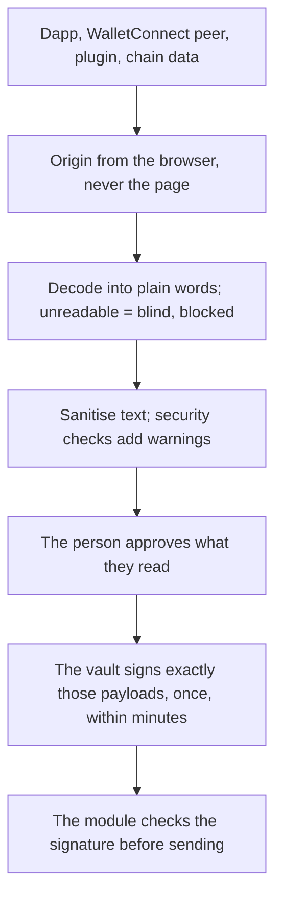

# Threat model

Clip Wallet holds keys, so its design starts from what can go wrong. This page summarises what it protects, from
whom, and how; the pages after it go deeper into each defence.

::: warning Pre-release
Clip Wallet has had an internal security review (October 2026) and **no external audit**. It runs on test networks
only. Report anything you find privately: [Report a vulnerability](./disclosure.md).
:::

## What we protect

| Asset | Must never | Defended by |
| --- | --- | --- |
| The recovery phrase and private keys | leave the vault, be logged or reach a server | one package touches them ([Rules](../guide/rules.md)); [Vault cryptography](./vault-crypto.md) |
| The ability to sign | sign anything the person didn't approve, or more than once | [Approval-bound signing](./approval-signing.md) |
| What the person reads before approving | differ from what is signed | decode-before-approve ([The signing flow](../architecture/signing-flow.md)); [Sanitising what you see](./sanitization.md) |
| The person's funds and approvals | go to a scam, a look-alike address or an unlimited spender unnoticed | [Phishing and scam checks](./scam-checks.md) |
| Private data (contacts, sites, settings) | reach anyone but the person's own devices | encrypted app data and sync ([Linked devices](../architecture/link.md)) |

## Who we defend against

- **A malicious or compromised website.** It can send any request through any connector. It can't claim another
  origin, see accounts before connecting, get a blind request signed by default, or get anything signed without an
  approval that shows it in plain words.
- **A malicious WalletConnect peer.** Its self-declared URL is never trusted unless WalletConnect Verify confirms it.
- **Misleading on-chain text.** Token names, NFT names and memos with invisible or direction-changing characters are
  stripped before display.
- **Scams and phishing.** Phishing-list sites, known-scam addresses, look-alike recipients, zero-value poisoning and
  brand-new contracts are flagged before approval.
- **A plugin.** Plugins run in an SES sandbox with no keys, no signing, no storage and no network beyond declared
  origins. See [Plugins](../architecture/plugins.md).
- **A hosted service.** The backup service, media proxy and link relay see ciphertext or public data only. A malicious
  backup server can withhold a blob, but can't open it.
- **A stolen device, locked.** The vault is Argon2id- and XChaCha20-Poly1305-protected at rest and auto-locks.
- **A compromised supply chain.** Pinned actions, Dependabot, CodeQL, reproducible extension builds and npm provenance
  on every package.

## Out of scope

Attacks that need a compromised operating system, browser or device, or physical access to an unlocked device; social
engineering of people; and the networks, RPC providers, swap providers and dapps themselves. The full scope is in
[`SECURITY.md`](repo:SECURITY.md).

## The layers

Each layer assumes the one before it can fail: a bad decode is still bound to the exact bytes; an approved payload
still signs only once; a plugin's note is labelled and kept apart from the wallet's own analysis.

## Extension and desktop hardening

- **Extension:** CSP `script-src 'self' 'wasm-unsafe-eval'` (WebAssembly for Argon2id only), no remote code, origins
  from the content script, optional permissions asked from a click.
- **Desktop:** every renderer sandboxed with context isolation and no Node; wallet windows under a strict CSP; one
  browser session per dapp origin; the 1Mask origin taken from the IPC sender frame; the vault file wrapped again by the
  OS secret store.
- **Phone:** the vault record in the platform's secure store; biometric unlock through a device key that never leaves
  the phone; the in-app browser's origin from the WebView, never the page.
