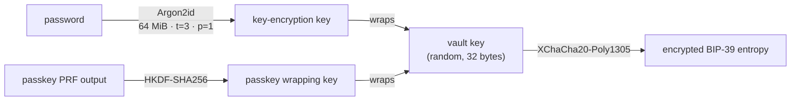

# Vault cryptography

Everything the vault stores is ciphertext and public metadata. This page is the summary; the
[vault README](repo:packages/vault/README.md) has every parameter and its source.

## At rest

- **Key derivation:** Argon2id with 64 MiB of memory, 3 iterations, parallelism 1, a 16-byte random salt and a 32-byte
  output: RFC 9106's second recommended setting, well above OWASP's minimum. About 0.2 s on a fast laptop, up to about
  1.5 s on slow hardware. Passwords are NFKC-normalised; the minimum length is 8.
- **Encryption:** XChaCha20-Poly1305 with random 24-byte nonces. Each box has its own associated data (the password
  wrap, the blob, each passkey wrap), so a box can't be moved into another slot.
- **A random vault key** encrypts the phrase. The password and each passkey wrap that key, so changing the password
  doesn't touch passkeys, and the password always keeps working.
- **Parameters travel with the record** and are bounds-checked (at most 1 GiB, 64 iterations, parallelism 4), so they can
  be raised later and a tampered record can't hang the wallet.
- **App data** (contacts, account labels) is encrypted under a key derived from the seed (HKDF), so it follows the
  wallet, not the password.

## In memory

While unlocked, only the 64-byte BIP-39 seed and the entropy stay in memory. The key-encryption key, vault key and
decrypted blob are wiped right after use; derived private keys are wiped after each sign or derive call; `lock()` wipes
the seed and entropy and clears every approval. Zeroisation in JavaScript is best effort.

**Auto-lock** after 15 minutes of inactivity by default, checked both by a timer and on every call, because a browser
can suspend the service worker and miss timers. A restarted service worker starts locked.

## Passkey unlock (WebAuthn PRF)

A passkey with the PRF extension produces a secret only that authenticator can produce. The vault picks a random PRF
input, and the PRF output, through HKDF, wraps the vault key. Unlocking evaluates the PRF again. If the authenticator
doesn't support PRF, the wallet doesn't offer passkey unlock and the password is used, with a plain explanation.

On the phone, Face ID, Touch ID or a fingerprint guard a device key held in the Keychain or Keystore; its HMAC over the
PRF input plays the same role. On macOS desktop, Touch ID releases a device secret in the same way.

## Passkey backup

`createPasskeyBackup(password, prfOutput)` makes an opaque blob: `"CLPB" ‖ version ‖ salt ‖ nonce ‖
XChaCha20-Poly1305(entropy)`, with the header as associated data, under a key from a fixed backup PRF input. The phrase
never leaves the vault. The [backup service](../services/backup.md) stores the blob and can't open it.

## Key derivation for every family

BIP-32 for secp256k1 (Initia's ethsecp256k1 included), SLIP-10 for ed25519, BIP32-Ed25519 for Cardano and Algorand,
sr25519 for Polkadot SDK chains, and the Stark curve's key grinding for Starknet; Antelope signatures are made
canonical, as its chains require. The paths match each ecosystem's popular wallets; see
[Vault](../architecture/vault.md#derivation). Every family is checked against its own SDK in the tests, with public test
vectors only.
