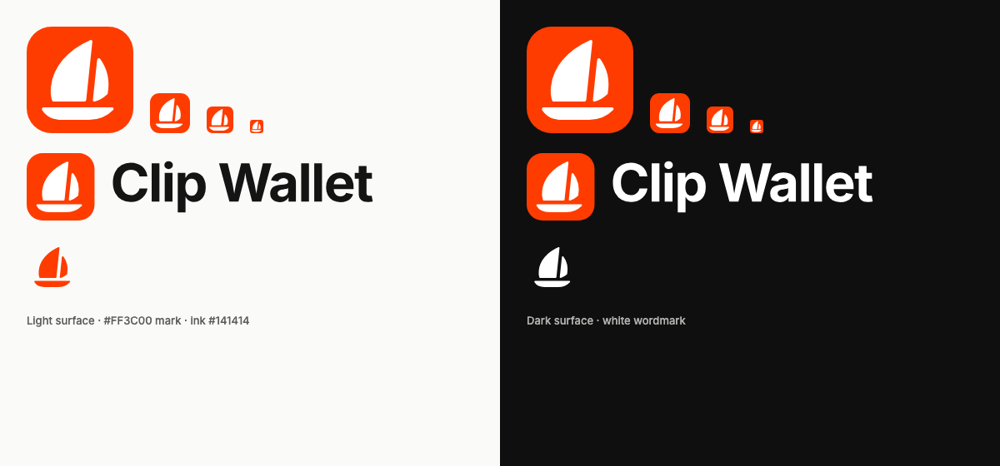

# Clip Wallet brand

  
  &nbsp;
  

**Name.** Clip Wallet, after CLPR, pronounced "clipper". The mark is a clipper under sail, leaning forward: a
C-shaped mainsail, a jib and a hull. It is drawn from scratch for Clip Wallet. It deliberately avoids animals,
faces, facets and shields so it can't be mistaken for another wallet's mark.

## Files

| File | Use |
|---|---|
| `clip-mark.svg` | App icon: white sail on an orange rounded square. The source for every icon (48 px and up) and for the identity data URI dapps see (EIP-6963, Wallet Standard) |
| `clip-mark-small.svg` | 16 and 32 px only: wider gaps and a heavier sail so the jib survives |
| `clip-glyph-{orange,white,ink}.svg` | The sail alone, for use on a plain background (Android adaptive/monochrome layers, splash, promo tiles) |
| `clip-wordmark-{ink,white}.svg` | "Clip Wallet" in Inter Bold, −2.5% tracking, outlined (no font needed) |
| `clip-lockup-{ink,white}.svg` | Mark + wordmark |
| `preview.png` | Review sheet (light and dark), not shipped |

Every PNG in the repo (extension icons, store graphics, mobile icon set, splash) is rendered from these by
`node tools/brand/render.mjs`. Never edit a PNG by hand; `tools/harness/test/brand.test.mjs` checks the copies.

## Colour

| Token | Hex | Use |
|---|---|---|
| ColdAI orange | `#FF3C00` | The mark, button fills, focus rings, promo backgrounds, large text |
| Accent ink (light) | `#C22E00` | Accent-coloured **small text** on light surfaces: links, active tabs, chips |
| Accent ink (dark) | `#FF6738` | Accent-coloured small text on dark surfaces |
| Ink | `#141414` | Wordmark and text on light backgrounds |
| White | `#FFFFFF` | Text and glyph on orange |

### The contrast issue, and what we did

White on `#FF3C00` is **3.56:1**. WCAG 2.2 asks for 4.5:1 for normal text (SC 1.4.3) and 3:1 for large text
(≥ 24 px, or ≥ 18.66 px bold) and for icons and UI component boundaries (SC 1.4.11). So `#FF3C00` is right for the
mark, fills and large text, and too light for 14 px links or labels in orange. The same holds for orange text on
white (3.56:1) and on the light surfaces (3.41:1 on `#FAFAF9`).

- **Small accent text (done):** `tokensFor()` derives `--clip-accent-ink`, the same hue darkened just enough to
  reach 4.5:1 on every light surface including the accent-soft chip background (`#C22E00`, 5.70:1 on white), or
  lightened for dark mode (`#FF6738`, 6.1:1 on `#18181A`). It works for any rebrand's accent, and is a no-op when
  the accent already passes. Mobile uses the same token.
- **Button labels (owner's call, not changed):** buttons keep `#FF3C00` with white text, as decided. Their labels
  are 15 px semibold, below the large-text size, so they are 3.56:1 against a 4.5:1 target. Two compliant options:
  1. **`#DE3400`** fill with white text: 4.57:1, the closest AA shade to ColdAI orange (visibly almost the same).
  2. Keep `#FF3C00` and set button labels at 19 px bold (counts as large text, 3:1 applies).
  To adopt option 1, set `theme.accent: "#DE3400"` in both `clip.config.ts` files; the mark and store graphics stay
  `#FF3C00`.

Ratios computed with the WCAG 2.2 relative-luminance formula (`contrast()` in `packages/ui/src/theme/tokens.ts`,
tested in `packages/ui/test/theme.test.ts`).

## Use

- Keep clear space around the mark of at least a quarter of its width. Don't recolour the sail, add effects,
  rotate it or put it on a busy photo.
- On orange use the white glyph; on white use `clip-mark.svg` or the orange glyph; on dark use the mark or the
  white glyph.
- Forks and kit-built wallets must use their own name and icon (`clip.config.ts`); the Clip Wallet name and mark
  are ColdAI trademarks and aren't licensed under Apache-2.0 (Section 6 grants no trademark rights; see `NOTICE`).
- Wordmark typeface: [Inter](https://rsms.me/inter/) © The Inter Project Authors, SIL Open Font License 1.1.
